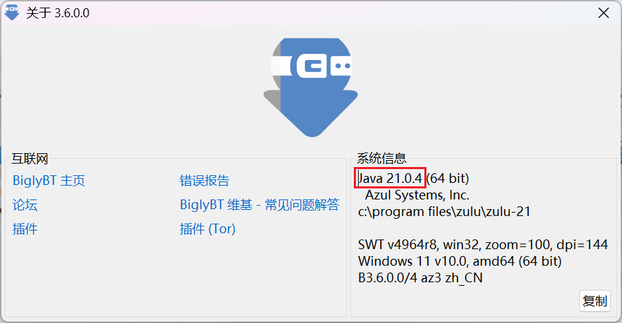

# BiglyBT/Azureus (Vuze)

:::warning

所有部署在 Docker 中的下载器，不得使用 bridge 桥接网络模式，必须使用 host 网络模式，以使下载器能够获取正确的 Peer 入站地址，否则 PeerBanHelper 将完全不会工作！ 

:::

:::tip

PeerBanHelper 与 BiglyBT 完全兼容，且支持效果最佳。

:::

PeerBanHelper 将通过 BiglyBT 的插件系统连接到 BiglyBT。
:::warning
您的 BiglyBT 必须运行在 Java 11 或更高版本上。如果是 Java 8 或更低版本，则无法使用，必须[切换 Java 版本](https://github.com/BiglySoftware/BiglyBT/wiki/Java-Versions)。
:::
## 确认 BiglyBT 的 Java 版本

1. 在 BiglyBT/Vuze/Azureus 中，点击“帮助”菜单，然后选择“关于 BiglyBT/Vuze/Azureus”。
2. 在弹出的窗口中，查看右侧的“系统信息”部分，确认`Java`后面的版本号。如果版本号是`8`或`1.8`，则不受支持，您需要升级 Java 版本。

## 升级 Java 版本（如需）

如果您的 BiglyBT 运行在 Java 8 上，您需要升级 Java 版本。

升级方法很简单，首先从 [Azul Zulu](https://www.azul.com/downloads/?version=java-21-lts&os=windows&architecture=x86-64-bit&package=jdk#zulu) 下载 Java 21 的 JDK。打开该链接时，页面会自动为您筛选适合的 JDK，直接下载安装即可。

## 安装 PBH-BiglyBT/PBH-Azureus 适配器

下载 BiglyBT 适配器：[PBH-BTN/PBH-Adapter-BiglyBT](https://github.com/PBH-BTN/PBH-Adapter-BiglyBT/releases)，请选择以 `.jar` 结尾的 JAR 包进行下载。
下载 Azureus/Vuze 适配器：[PBH-BTN/PBH-Adapter-Azureus](https://github.com/PBH-BTN/PBH-Adapter-Azureus/releases)。

接下来的安装步骤类似。

1. 在 BiglyBT 中，选择“工具”->“插件”->“从文件安装……”。

2. 选中刚刚下载的 JAR 包，点击“下一步”进行安装。

3. 如果 BiglyBT 询问安装对象，请根据您的需求选择。如无特殊要求，请选择默认选项。

4. 在弹出插件安装对话框后，点击“安装”按钮。

5. 如果出现安全警告，请允许继续安装。

6. 直到提示安装成功，此时 PeerBanHelper BiglyBT Adapter 的安装过程就完成了。请继续按照下面的教程进行配置。

## 配置 PBH-BiglyBT/PBH-Azureus 适配器

为了安全起见，PBH-Adapter-BiglyBT 会生成一个随机 Token。您需要获取这个 Token，才能在 PeerBanHelper 中连接到您的 BiglyBT 下载器。

1. 点击“工具”->“选项”打开选项窗口。
2. 点击“插件”左侧的倒三角标志，展开插件配置菜单。

3. 找到“PeerBanHelper 适配器 - 配置界面”，点击进入配置页面。

4. 配置 API 端口号，并记下 Token。**务必点击一次“保存”按钮，否则重启后 Token 将重新生成。**

:::warning
**重要提示**：请确保点击保存按钮，否则重启 BiglyBT 后，Token 将重新生成，导致之前的配置失效。
:::

## 连接到 PeerBanHelper

在 PeerBanHelper 的添加下载器页面，选择 BiglyBT（Azureus/Vuze 用户也请选择这个选项）。

1. 选择“BiglyBT”，并填写刚刚设置的端口号和记下的 Token。

2. 点击确定保存，即完成添加。