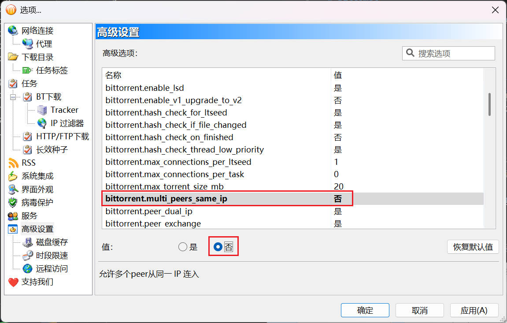
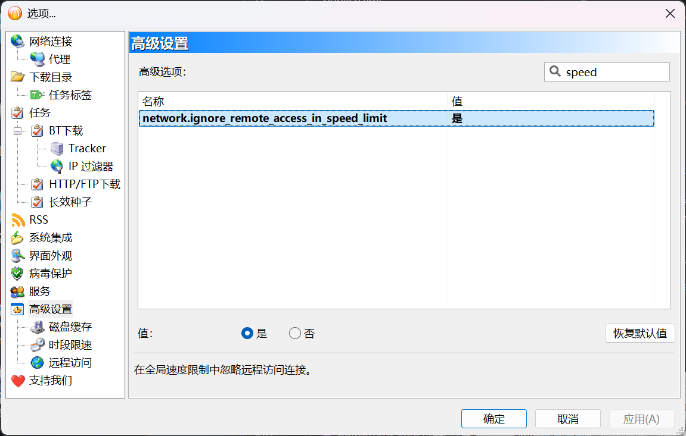
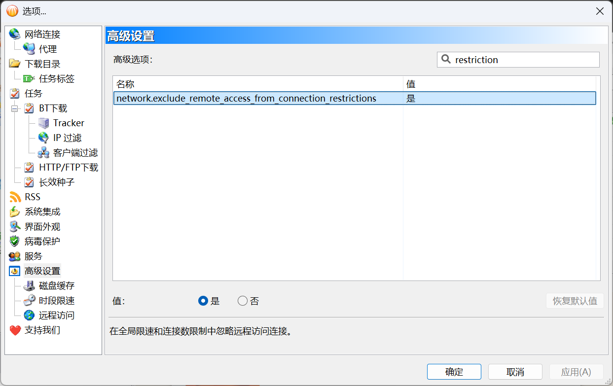

# BitComet

:::warning

所有部署在 Docker 中的下载器，不得使用 bridge 桥接网络模式，必须使用 host 网络模式，以使下载器能够获取正确的 Peer 入站地址，否则 PeerBanHelper 将完全不会工作！ 

:::

PeerBanHelper 利用 BitComet 的 WebAPI 与 BitComet 进行交互。本章将指导您如何为 BitComet 启用 WebAPI，并将其与 PeerBanHelper 连接。

## 注意事项

:::danger

**重要提示**：BitComet 的支持目前仍处于高度实验性阶段，对于封禁效果和运行稳定性，我们不做任何保证。
:::

BitComet 用户可能会经常遇到“正在封禁的 Peer 已处于封禁列表中”的提示，这是由于 BitComet 的封禁操作是异步处理的。在大多数情况下，您可以安全地忽略此警告（除非它持续不断地出现）。如果您遇到封禁线程未响应或“Unable to retrieve peers”的错误提示，这通常是由于 BitComet 的 WebAPI 超时未响应。该问题已反馈给 BitComet，但尚未得到修复。请放心，PeerBanHelper 会在下一次封禁流程中重新尝试获取。

## 确认版本

PeerBanHelper 所需的 WebAPI 仅在 `v2.10 Beta6 [20240928]` 或更高版本中可用。

:::warning
**版本要求**：任何低于此版本的 BitComet 均无法使用且不受支持。
:::

## 启用 IP 过滤器

1. 在 BitComet 中，点击“工具”->“选项”以打开设置界面。
2. 在左侧树形菜单中，依次展开“任务”->“BT 下载”->“IP 过滤器”。
3. 在过滤器配置页面中，勾选“按 IP 列表筛选 Peer”，并选择“黑名单模式”。

## 配置禁止多重连接

允许多重连接可能会干扰 PeerBanHelper 的反作弊机制，因此必须禁用此功能。

1. 在设置界面左侧树形菜单中，选择“高级设置”。
2. 找到`bittorrent.multi_peers_same_ip`，并将其值设置为“否”。

## 禁用 WebUI 限速

默认情况下，WebUI 会受到网络连接中的速度限制。这可能会影响 PeerBanHelper 访问 BitComet WebAPI 的性能，导致封禁失败和延迟。因此，需要禁用此功能。

1. 在设置界面左侧树形菜单中，选择“高级设置”。
2. 关闭远程访问速度限制  
  （如果使用的是较旧版本）找到`network.ignore_remote_access_in_speed_limit`，并将其值设置为“是”。  
  （如果使用的是较新版本）找到`network.exclude_remote_access_from_connection_restrictions`，并将其值设置为“是”。

| 较旧版本 | 较新版本 |
| ------- | ------- |
|  |  |

## 启用远程访问

PeerBanHelper 需要通过远程访问功能连接 BitComet。此功能默认关闭，需要手动启用。

1. 在设置界面左侧树形菜单中，选择“高级设置”->“远程访问”。
2. 勾选“启用网页版远程访问”，并设置一个用户名和密码。
3. 记下显示的端口号，稍后需要在 PeerBanHelper 中使用。

:::warning
**安全提示**
- 请设置强密码以保护您的 BitComet
- 如果只在本地使用，建议将访问限制为 127.0.0.1
- 确保防火墙配置正确，只开放必要端口
:::

 

完成所有设置后，请确保点击保存。

## 在 PeerBanHelper 中添加 BitComet

1. 在 PeerBanHelper 中，打开添加下载器窗口。
2. 选择 BitComet 类型。

地址配置分为两种情况：

- 如果 BitComet 和 PeerBanHelper 在同一台设备上，请使用 `http://127.0.0.1:端口号`，其中 `端口号` 替换为您之前记下的端口。
- 如果 BitComet 和 PeerBanHelper 不在同一台设备上，请使用 BitComet “高级设置”->“远程访问”界面中显示的地址。

3. 最后，点击确定保存设置。如果测试通过，即可开始使用。