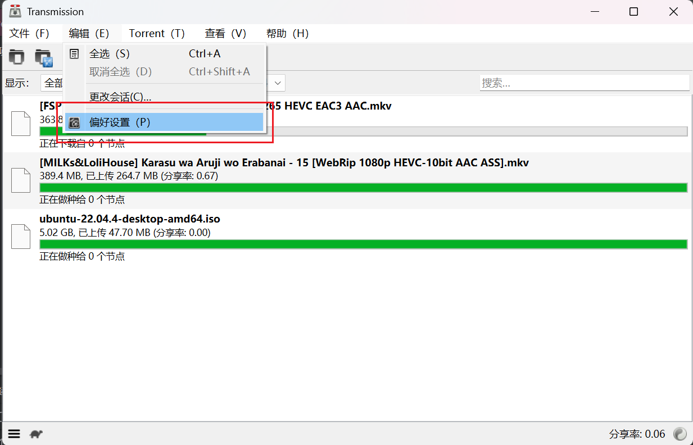
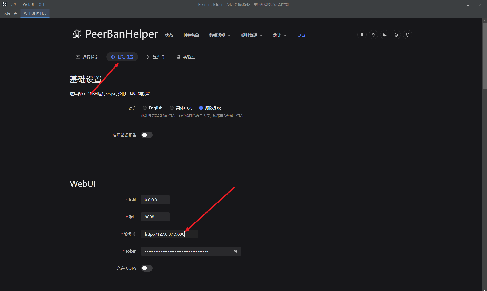

# Transmission

:::warning

所有部署在 Docker 中的下载器，不得使用 bridge 桥接网络模式，必须使用 host 网络模式，以使下载器能够获取正确的 Peer 入站地址，否则 PeerBanHelper 将完全不会工作！

:::

只有 v4.1.0-beta2 或者更新版本的 Transmission 才能添加和和支持。没有任何例外情况。请不要再问某某个版本能否支持了。比 v4.1.0-beta2 低的就是不行！

对于在 Linux 和 Docker 上使用 Transmission 的用户，你大概已经配置好了 WebUI，可以跳过前面的步骤。

## 启用 WebUI

1. 点击 “编辑” 菜单，进入 “偏好设置”，并转到 “远程” 选项卡
2. 勾选 “允许远程访问”
3. 勾选 “使用身份验证”，并配置一个用户名和密码
4. 点击关闭




## 配置 PeerBanHelper 屏蔽列表提供端点

由于 Transmission 的封禁列表更新方式是主动拉取，而非 PeerBanHelper 向其推送。因此你需要配置一个 “屏蔽列表提供端点”，向 Transmission 提供 HTTP 服务来提供封禁列表。  
不过别担心，PeerBanHelper 已经帮你完成了这个任务。PBH 的 WebUI 的 HTTP 服务器也可以兼任这个角色。这样当封禁列表有任何变化时，PeerBanHelper 就会自动更新并通知 Transmission 拉取。

你需要打开 PeerBanHelper 的 WebUI 并转到 “设置 -> 基础设置 -> WebUI -> 前缀”，将其设置为一个在 Transmission 所在位置可访问 PeerBanHelper WebUI 的地址。  



对于 PeerBanHelper 和 Transmission 安装在相同设备、相同系统中，且没有容器隔离的普通环境下，前缀固定为：

```plain
http://127.0.0.1:<PBHWebUI端口>
```

如：

```plain
http://127.0.0.1:9898
```

注意不要以斜线结尾。  
保存配置后，添加 Transmission 下载器，如果能够成功添加，则说明配置正确。

## 添加 Transmission 到 PeerBanHepler 中

1. 打开添加下载器窗口
2. 顶部下载器类型，选择 “Transmission”
3. 名称可随意填写，唯一的要求是不要带有英文句号（`.`）
4. 地址部分，填写访问 Transmission WebUI 的地址，端口是你上面设置的端口号。填写地址时，特别注意不要以 `/` 结尾
5. 用户名为上面设置 “验证” 时，填写的用户名
6. 密码为上面设置 “验证” 时，填写的密码
7. 点击确定，提示成功即添加成功
