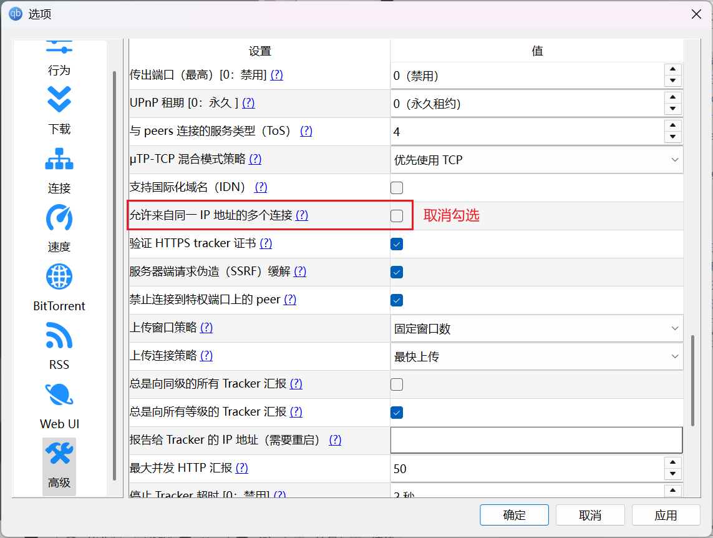
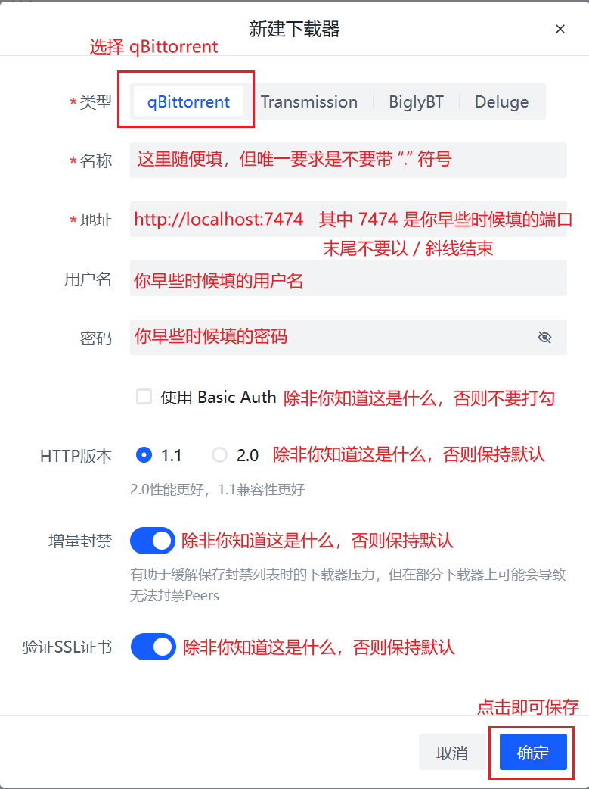

# qBittorrent

:::warning

所有部署在 Docker 中的下载器，不得使用 bridge 桥接网络模式，必须使用 host 网络模式，以使下载器能够获取正确的 Peer 入站地址，否则 PeerBanHelper 将完全不会工作！ 

:::

PeerBanHelper 利用 qBittorrent 的 WebAPI 与 qBittorrent 进行交互。本章将详细指导您如何为 qBittorrent 启用 WebUI，并将其与 PeerBanHelper 成功连接。对于在 Linux 和 Docker 环境中使用 qBittorrent 的用户，如果您已经配置好了 WebUI，可以跳过前面的相关步骤。

## 启用 WebUI

请点击主页面上的齿轮图标，以打开设置菜单。

接下来，请按照以下步骤操作：

1. 在左侧菜单中，切换到“WebUI”选项卡。
2. 勾选“启用 Web 用户界面（远程控制）”。
3. 配置一个端口号，本例中我们使用`7474`。请注意，这里的“IP地址”实际上是指“监听网卡地址”，如果不确定其含义，可以保持默认为`*`，不过，如果您的防火墙配置不当，其他人也可访问到您的 qBittorrent WebUI。
4. 在“身份验证”部分，设置一个用户名和高强度密码。若密码被他人猜中，他们可能会访问 qBittorrent 下载文件或执行命令/程序。
5. 最后，点击右下角的“应用”按钮，以保存设置。

:::warning
**安全提示**
- 请设置强密码以保护您的 qBittorrent
- 如果只在本地使用，建议将访问限制为 127.0.0.1
- 确保防火墙配置正确，只开放必要端口
:::

## 配置高级选项

除了启用 WebUI 外，还需进行一些设置调整，以确保 PeerBanHelper 能够正常运行：

1. 在左侧菜单中，切换到“高级”选项卡。
2. 继续向下滚动页面，在“libtorrent 相关”部分，找到“允许来自同一 IP 地址的多个连接”选项，如果已被勾选，请**取消勾选**。

:::tip
在 `v7.2.0` 及以上版本，下载器连接到 PBH 时，PBH 会自动关闭“允许来自同一 IP 地址的多个连接”选项，如果你使用的版本正确，则无需手动配置此选项。
:::

## 在 PeerBanHelper 中添加 qBittorrent 下载器

请按照以下步骤添加下载器：

1. 打开 PeerBanHelper 的添加下载器窗口。
2. 在顶部下载器类型中，选择“qBittorrent”。
3. 名称可随意填写，但请确保不要包含英文句号（`.`）。
4. 在地址栏中，填写`http://localhost:7474`，其中`7474`是您之前设置的端口号。请注意，填写地址时，不要以斜杠（`/`）结尾。
5. 用户名和密码请填写您在“身份验证”部分设置的内容。
6. 点击“确定”按钮，如果提示成功，则表示添加成功。

