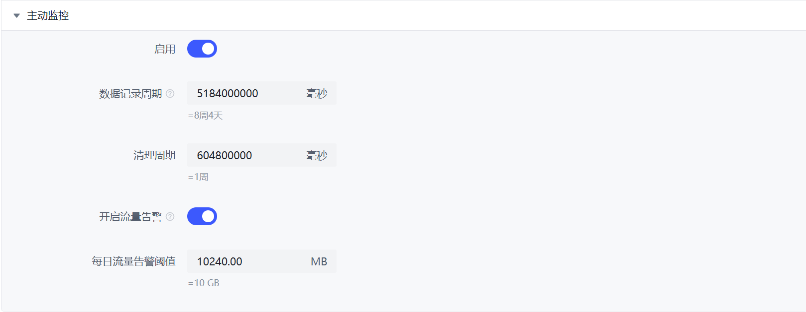

# 主动监测

一些 PBH 提供的统计功能需要此模块开启。  
启用主动监测后，PBH 会将每次扫描下载器获取的所有 Peers 数据全部存入/更新到数据库中，以提供可视化统计数据和流量告警服务。  

不建议 EMMC 芯片和 SD 卡用户启用此功能。除了会影响性能，还可能加快闪存芯片磨损。  

Transmission, BitComet 用户因 API 限制可能缺失部分数据。

## 需要此功能支持的功能

* 流量统计图表
* 趋势图表
* GeoIP 图表的非封禁部分

## 配置流量告警

转到 设置 -> 首选项，向下找到 “主动监控”，打开流量告警并配置每日流量告警阈值。

配置完成后，点击页面底部的 “保存” 按钮即可生效。

## 会记录的 Peer 的有关数据

按照 IP-种子记录，每个 IP 连接到一个不同的种子都视为一个会话。

* 会话 IP 地址
* 会话 Torrent 元数据
* 会话 下载器名称
* 会话最后一次使用的 Peer ID
* 会话最后一次使用的 Peer ClientName
* 会话中向 Peer 上传的累计数据量
* 会话中向 Peer 上传的最后一次记录的下载器统计数据
* 会话中从 Peer 下载的累计数据量
* 会话中从 Peer 下载的最后一次记录的下载器统计数据
* 此会话最后一次见到时的 Peer Flags
* 会话开始时间
* 会话最后更新时间
