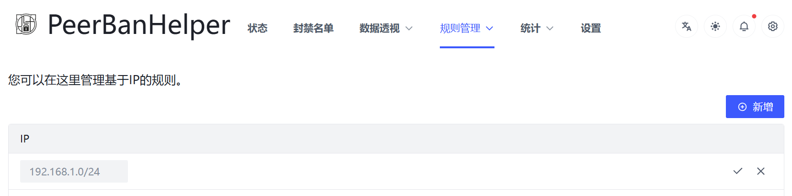
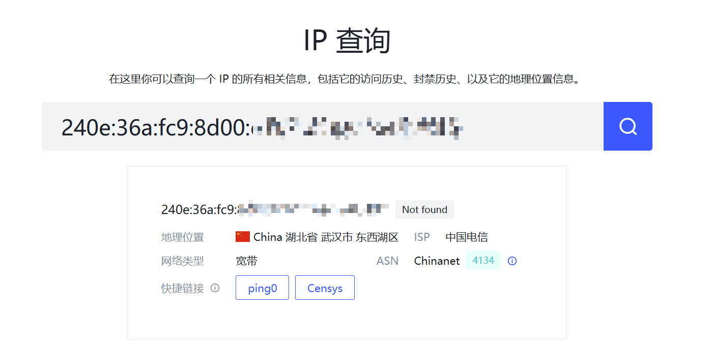

# IP 封禁

由于 PeerBanHelper 通过操作下载器的 IP 黑名单实现 Peer 封禁，因此毫无疑问，您的 IP 黑名单绝对会被 PeerBanHelper 覆盖掉。因此 PeerBanHelper 内置了一个单独的 IP 黑名单功能。
:::tip
不建议通过配置文件配置此功能，您可以直接使用 WebUI 的可视化编辑。
:::
## IPs

IP 黑名单，支持输入一个或多个 IP 地址或者 CIDR 地址。列出的 IP 或者被 CIDR 包含的 IP 将在连接下载器时被封禁。

该模块接受 IPV4 地址或者 IPV6 地址，同时也支持 IPV4 和 IPV6 的 CIDR。



## Ports

端口黑名单，支持输入一个或多个端口。任意 IP 使用列出的端口连接到您的下载器时即会被封禁。

该功能通常情况下没人用，此处不做解释。

## ASNs

ASN 黑名单。需要配合 Maxmind GeoLite2 ASN 数据库使用。ASN 数据库应该会在启动 PBH 时伴随 IPDB 一起下载。  
支持输入一个或者多个 [ASN](https://zh-hans.ipshu.com/asn_list)，所有在给定的 ASN 内的 IP 地址在连接到您的下载器即会被封禁。

不建议中国大陆地区使用 ASN 封禁，因为 AOE 范围可能过大。

## Regions

国家/地区黑名单。可以输入一个或者多个 [ISO 3166-1 国家二字母码](https://www.rr78.com/World/postal/)。需要配合 Maxmind GeoLite2 City 数据库。 City 数据库应该会在启动 PBH 时伴随 IPDB 一起下载。 

## Cities

城市黑名单。对于境外城市，使用 Maxmind 城市名称。如果是 GeoCN 收录的城市（中国大陆境内、部分台湾香港澳门），使用标准简体中文名称。  
使用包含匹配算法，只要名称中包含给定关键字，即封禁：

* `New York` - 封禁美国纽约
* `济南` - 封禁任何省的济南市
* `山东省 济南市` - 封禁山东省的济南市
* `垦利县` - 封禁任何省市的垦利县
* `东营区` - 封禁任何省市的东营区
* `北京` - 封禁北京直辖市
* `上海` - 封禁上海直辖市


如图所示：第一条规则精准匹配辽宁省大连市沙河口区（其它区不受影响），第二条匹配辽宁省大连市（整个市都会被封禁）。

如果你不清楚对方处于哪里（或者该怎么填写），可以使用 “数据透视” 菜单下的 [IP 查询](../statistic/ip-query.md)功能查询其地理位置。



## Net Type

网络类型黑名单。需要配合 GeoCN 数据库。 GeoCN 数据库应该会在启动 PBH 时伴随 IPDB 一起下载。  

如果 IP 的网络类型被 GeoCN 数据库收录，则可以封禁对应网络类型的 IP 地址。

目前只能通过配置文件编辑此设置。

## 配置文件

```yaml
  # IP 地址/端口 封禁
  # IP address/port blacklist
  ip-address-blocker:
    enabled: true
    # 封禁时间，单位：毫秒，使用 default 则跟随全局设置
    ban-duration: 259200000
    # 按 IP 封禁，支持 CIDR，其语法大致如下：
    # Banning IP address, support CIDR, syntax example:
    # ::/64
    # a:b:c:d::a:b/64
    # a:b:c:d:e:f:1.2.3.4/112
    # 1.2.3.4/16
    # 1.2.255.4/255.255.0.0
    ips:
      - "0.0.0.0"
    #- 8.8.8.8
    #- 9.9.9.9
    # 按端口封禁
    # Banning ports
    ports:
      - 0
    #- 2003
    # 按 ASN（自治系统代码）封禁（需要配置 GeoIP-ASN 数据库才能工作！）
    # Banning ASN (Require config GeoIP-ASN database)
    asns:
      - "0"
    #  - 0 # 网络 ASN 号
    # 按国家或地区封禁（需要配置 GeoIP-City 数据库才能工作！）
    # Banning as Country/Region code
    regions:
      - "0"
    # 按城市/区/县封禁
    # 默认使用 Maxmind 名称，如果成功加载 GeoCN 数据库，则对在 GeoCN 数据库中的 IP 地址使用 GeoCN 写法
    # Banning as city name
    # Use Maxmind name as default, or use GeoCN name for record exists in GeoCN if GeoCN is loaded
    cities:
      - "示例海南"
    #  - ISO_CODE 输入国家或地区的 ISO 代码，大小写敏感，如：CN, UK, TW, HK, JP 等
    #  - ISO_CODE Enter the ISO code, case sensitive (E.g. CN, UK, TW, HK, JP, etc.)
    # 按网络类型封禁（仅中国大陆地区 IP 地址有效）
    # Banning as net type (only works for China Mainland IPs, Require config GeoIP database)
    net-type:
      # 宽带
      wideband: false
      # 基站
      base-station: false
      # 政企专线
      government-and-enterprise-line: false
      # 业务平台
      business-platform: false
      # 骨干网
      backbone-network: false
      # IP 专网
      ip-private-network: false
      # 网吧
      internet-cafe: false
      # 物联网
      iot: false
      # 数据中心
      datacenter: false
```
