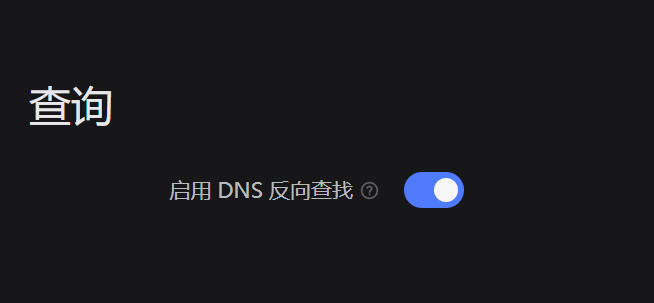
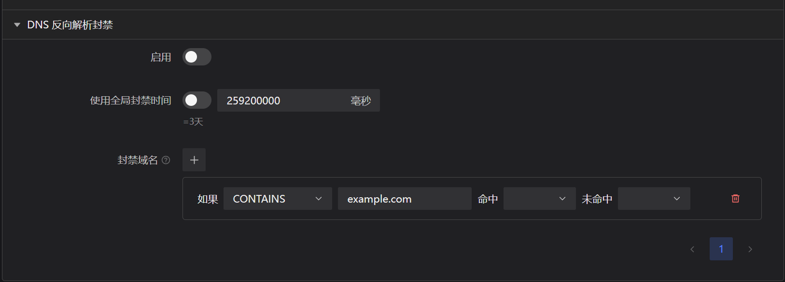

# DNS 反向解析

:::info
这是 [PTR反向解析记录](https://www.cloudflare.com/zh-cn/learning/dns/dns-records/dns-ptr-record/)，而非反向域名解析。此功能反向解析的是**主机名**而非广义上的域名。
:::

## 什么是主机名？

如果你使用过 qBittorrent 并打开过设置里的 “解析用户主机名” 开关，那么你应该对下面的场景非常熟悉。


图中被红色标记的就是 “主机名”，本模块检测的正是这些 “主机名”。

## 使用

### 允许 DNS 反查

默认情况下，PeerBanHelper 的 DNS 反查功能处于禁用状态。这是因为频繁的进行查询，可能导致你使用的 DNS 服务器拒绝给你继续提供服务，从而影响你的正常上网。

你需要前往 “设置 -> 基本设置 -> 查询” 并打开 “启用 DNS 反向查找” 开关，并保存。



### 启用 DNSJava

默认情况下，PeerBanHelper 使用 JDK 解析器，但 JDK 解析器通常不能很好的工作。因此你最好启用 “DNSJava 实验”。

前往 “设置 -> 实验室”，然后打开 “启用实验性功能”。在下面的列表中找到并打开 “DNSJava DNS 解析”，此时你就切换到了 DNSJava 解析器。

### 配置规则

前往 “设置 -> 首选项 -> DNS 反向解析记录”，展开即可为主机名配置对应的规则。



### 配置文件

```yaml
  # PTR （反向解析记录） 封禁
  # 此模块将强制对 Peer IP 进行 PTR 查询，并试图解析其 IP 地址绑定的主机名。如果 IP 地址绑定了一个主机名且主机名匹配下列规则，则执行操作
  # PTR (Reverse DNS) Blocker
  # This module will force to do PTR query on Peer IP, and try to resolve the hostname that bind with IP address. If the IP address bind with a hostname and the hostname match the rules below, then do the action
  ptr-blacklist:
    enabled: false
    # 封禁时间，单位：毫秒，使用 default 则跟随全局设置
    # BanDuration, Timeunit: ms, use `default` to fallback to global settings
    ban-duration: 259200000
    # method = 匹配方式 - Match Method
    #  + STARTS_WITH = 匹配开头 - Match the starts
    #  + ENDS_WITH = 匹配结尾 - Match the ends
    #  + LENGTH = 匹配字符串长度 - Match the string length
    #     + 支持的额外字段 - Other supported fields
    #       * min = 最小长度 - Min length
    #       * max = 最大长度 - Max length
    #  + CONTAINS = 匹配包含 - Match the contains
    #  + EQUALS = 匹配相同 - Match the equals
    #  + REGEX = 匹配正则表达式（大小写敏感） - Match the regex (case-sensitive)
    # content = 匹配的内容（除正则外忽略大小写） - The content will be matched
    # if = 表达式控制器，当 if 的表达式为 true 时，则检查此规则；否则此规则被忽略。 # if controller, `0` or `false` will skip this rule
    #  + if 表达式可以为 true/false, 1/0 或者一个嵌套的规则 # the return result can be `true` or `false` and `0` or `1`
    # hit = 匹配成功返回的行为代码 # the behavior if matched
    #  + TRUE = 在 if 中代表 true，在规则中代表 BAN（封禁） # true in if controller, BAN in rule
    #  + FALSE = 在 if 中代表 false，在规则中代表 SKIP（排除） # false in if controller, SKIP in rule
    #  + DEFAULT = 在 if 中代表 true，在规则中代表 NO_ACTION（默认行为） # true in if controller, NO_ACTION in rule
    # miss = 匹配失败返回的行为代码（与上相同） # the behavior if match failed, same as above
    # 规则从上到下执行
    ptr-rules:
      - '{"method":"EQUALS","content":"example.com"}'
```