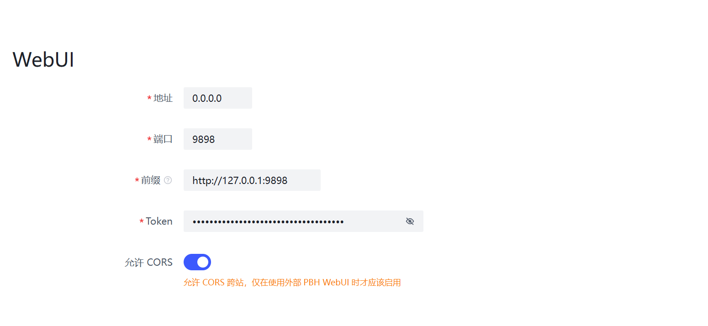

# HTTP 服务器配置

PeerBanHelper 集成了 Javalin 作为其内置的 HTTP 服务器，以支持 WebUI 管理界面，并与部分下载器进行交互。

## 修改 WebUI 端口号

```yaml
# Http 服务器设置
# Http Server Settings
server:
  # WebUI 监听端口
  # WebUI listen port
  http: 9898
```

或者通过 WebUI 直接修改：



## 限制 WebUI 监听本地网络

为了提升安全性，您可以将 WebUI 的监听地址配置为仅允许本地访问。

```yaml
# Http 服务器设置
# Http Server Settings
server:
  ...
  # WebUI 监听地址，如果需要从非本机访问，请修改为 0.0.0.0，本机部署建议使用 127.0.0.1 提高安全性
  # WebUI listen address, if you need access from non-localhost location, change it to 0.0.0.0. Locally deploy use 127.0.0.1 is recommended.
  address: "0.0.0.0"
```

或者通过 WebUI 直接修改 “地址” 配置项。

`0.0.0.0`：监听所有网卡的端口  
`127.0.0.1`：监听本地回环端口（仅本机可以访问）  
`网卡 IP 地址`：只有对应网卡的流量可以访问

将 `address` 设置为 `"127.0.0.1"` 可以确保只有本地机器能够访问 WebUI 和下载器封禁列表的端点。

## 使用自定义 WebUI

PeerBanHelper 支持从文件系统加载自定义的 WebUI 文件。

您需要在 `data/` 文件夹下手动创建一个名为 `static` 的目录，并将自定义的 WebUI 文件放置在其中。然后，在配置文件中添加相应的设置以启用自定义 WebUI：

```yaml
# Http 服务器设置
# Http Server Settings
server:
  ...
  # 使用外部 WebUI
  external-webui: true
```

## 跨域资源共享（CORS）设置

出于安全考虑，PeerBanHelper 默认启用了 CORS 保护。如果您使用非内置 HTTP 服务器提供的 WebUI，则需要禁用 CORS 保护。

```yaml
# Http 服务器设置
# Http Server Settings
server:
  ...
  # 允许 CORS 跨站，仅在使用外部 PBH WebUI 时才应该启用
  # Allow CORS, should be enabled when you use external WebUI only.
  allow-cors: false
```

或者在 WebUI 中直接切换 “允许 CORS” 开关。

注意：将 `allow-cors` 设置为 `true` 可以允许跨域访问，但请注意这可能会带来安全风险。

## 修改 WebUI Token

如果您忘记了 WebUI 的访问令牌，或者希望更改令牌，可以在配置文件中进行更新：

```yaml
# Http 服务器设置
# Http Server Settings
server:
  ...
  # 要访问 WebUI 端点，则需要 Token。如果这里为空，PBH 在启用时将进入 OOBE 向导，指导您进行基本配置
  # To access the WebUI endpoint, token is required. If there is empty string, OOBE will start to guide you set it.
  token: ""
```

## 开发自定义 WebUI/WebAPI


我们鼓励开发者为 PeerBanHelper 创建或改进 WebUI。

自 v6.0.1 版本起，您可以在以下链接查看完整的 API 文档：

[https://peerbanhelper.apifox.cn](https://peerbanhelper.apifox.cn)

请注意：若 WebAPI 连续鉴权失败达到 10 次，您的 IP 地址将被防暴力破解系统屏蔽 15 分钟。

## 完整的配置文件示例

```yaml
# Http 服务器设置
# Http Server Settings
server:
  # WebUI 监听端口
  # WebUI listen port
  http: 9898
  # WebUI 监听地址，如果需要从非本机访问，请修改为 0.0.0.0，本机部署建议使用 127.0.0.1 提高安全性
  # WebUI listen address, if you need access from non-localhost location, change it to 0.0.0.0. Locally deploy use 127.0.0.1 is recommended.
  address: "0.0.0.0"
  # 在 PBH 需要给下载器传递地址时，将使用此地址传递，请确保此地址最终可被下载器访问，请【不要】以 / 结尾
  # When PBH need pass the URL of blocklist to downloader, it will use this address as prefix, make sure this URL can be access from your downloader. DO NOT end with slash (/)
  prefix: "http://127.0.0.1:9898"
  # 要访问 WebUI 端点，则需要 Token。如果这里为空，PBH 在启用时将进入 OOBE 向导，指导您进行基本配置
  # To access the WebUI endpoint, token is required. If there is empty string, OOBE will start to guide you set it.
  token: ""
  # 允许 CORS 跨站，仅在使用外部 PBH WebUI 时才应该启用
  # Allow CORS, should be enabled when you use external WebUI only.
  allow-cors: false
```