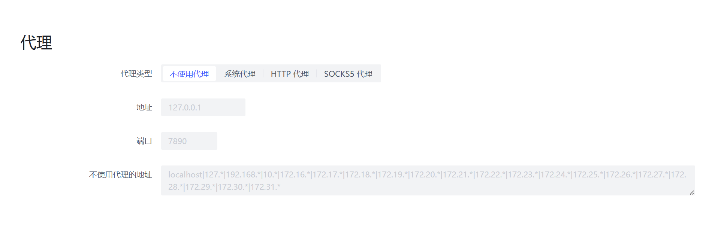

# 代理服务器

尽管修改 JVM 参数也能让 PBH 使用代理服务器，但我们推荐您通过配置文件修改相关配置。



不使用代理：不使用任何代理服务器，包括系统代理。  
系统代理：自动使用系统代理服务器（也就是俗称的 IE 代理）  
HTTP 代理：指定 HTTP 代理服务器的 IP 和端口号，暂不支持需要登陆的 HTTP 代理  
Socks5 代理：目前不可用

## 配置文件
```yaml
# 代理服务器设定
# Proxy server settings
proxy:
  # 代理服务器设置 Proxy server setting
  # 注意：不支持需要密码验证的代理服务器 NOTE: Authentication required proxy servers are not supported
  # 0 = 不使用代理 - No proxy
  # 1 = 使用系统代理 - Use system proxy
  # 2 = 使用 HTTP(s) 代理 - Use HTTP(s) proxy
  # 3 = 使用 socks5 代理(可能无法使用) - Use socks5 proxy (may not work well)
  setting: 1
  # 代理服务器地址 - Proxy server host
  host: "127.0.0.1"
  # 代理服务器端口号 - Proxy server port
  port: 7890
  # 代理例外地址，使用 | 分隔不同条目 - Exception list, spilt with | symbol
  non-proxy-hosts: "localhost|127.*|192.168.*|10.*|172.16.*|172.17.*|172.18.*|172.19.*|172.20.*|172.21.*|172.22.*|172.23.*|172.24.*|172.25.*|172.26.*|172.27.*|172.28.*|172.29.*|172.30.*|172.31.*|*.local|*.lan"
```