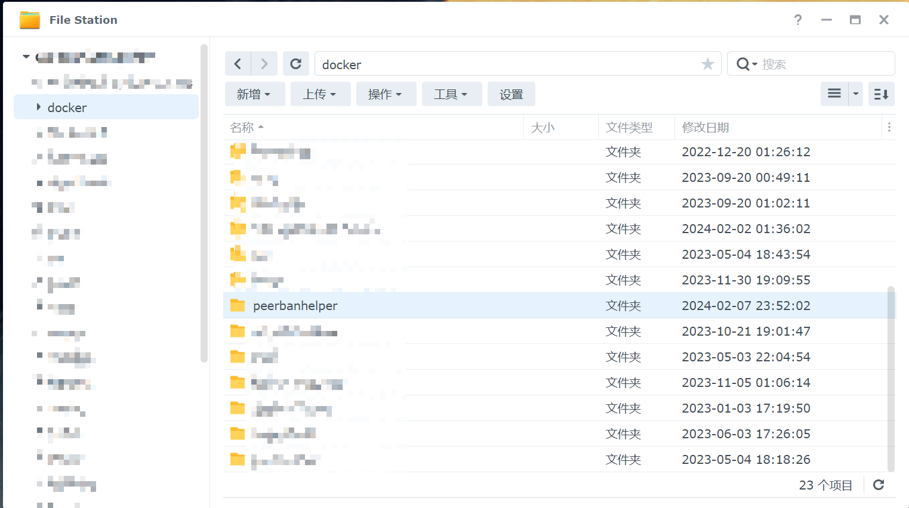
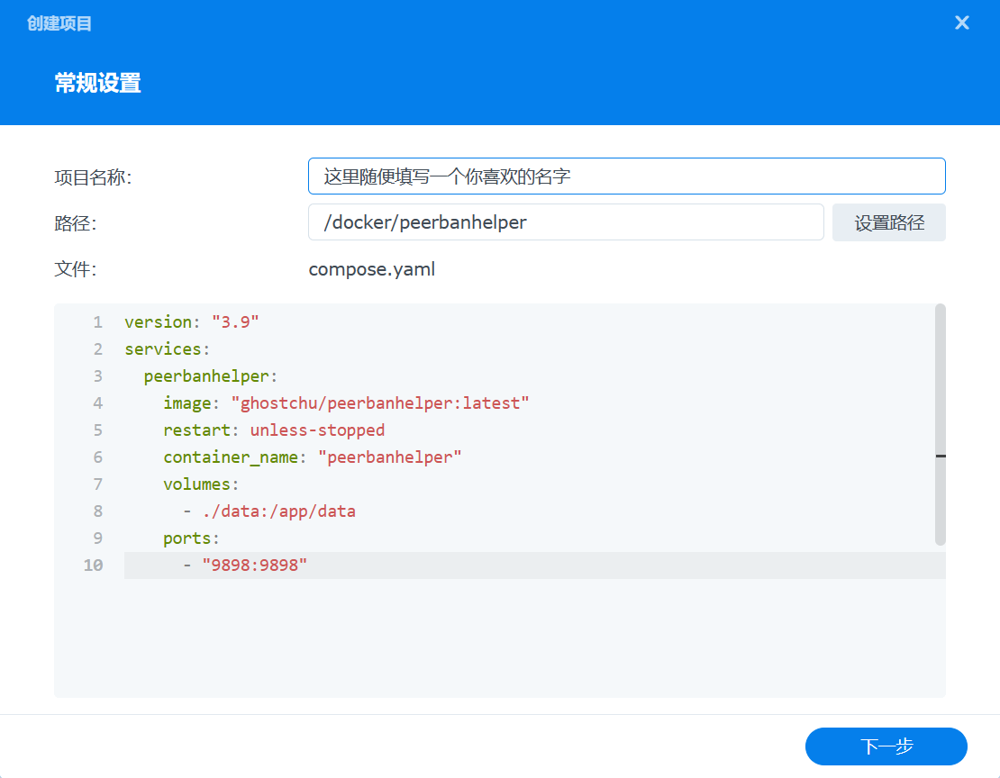
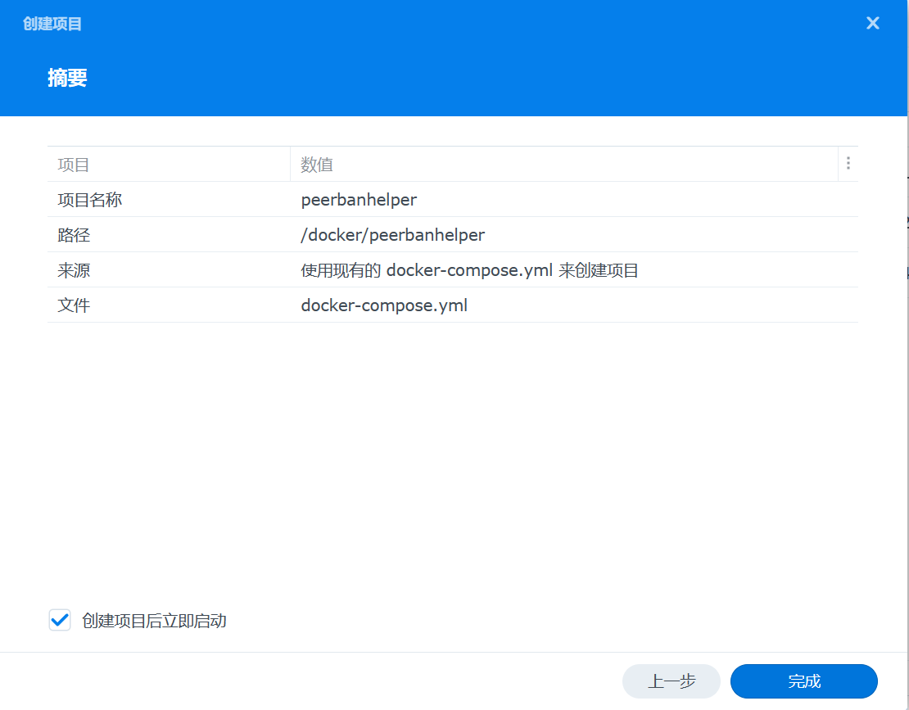

# 使用 Docker 部署

## 创建数据目录

首先，为 PeerBanHelper（以下简称 PBH）创建一个文件夹，用于存储其配置文件。



在 Docker Container Manager 中，选择项目，点击“新增”按钮，并在来源选项中选择“创建 docker-compose.yml”（请注意，务必先选择来源，以避免覆盖已设置的内容）。


接着，点击“设置路径”按钮，将 Docker Compose 的位置配置为我们刚刚创建的文件夹：


## 获取镜像标签

首先，访问 [PBH 最新版本发布页](https://github.com/PBH-BTN/PeerBanHelper/releases/latest)，在“Docker 用户”章节中找到镜像标签，并复制备用。


**注意：避免拉取 `latest` 标签的镜像，因为这可能是一个较旧或开发中的版本，且可能无法获得官方支持。**

接下来，创建一个 `docker-compose.yml` 文件，并填入以下内容（请根据复制的镜像标签进行替换）：

```yaml
version: "3.9"
services:
  peerbanhelper:
    image: "ghcr.io/pbh-btn/peerbanhelper:复制的镜像标签"
    restart: unless-stopped
    container_name: "peerbanhelper"
    volumes:
      - ./data:/app/data
    ports:
      - "9898:9898"
    environment:
      - PUID=0
      - PGID=0
      - TZ=Asia/Shanghai # 根据您的时区进行调整
```

**注意**：上述示例中的 `./data` 是指 Docker Compose 文件所在目录下的 `data` 文件夹，它将映射到容器内的 `/app/data`。同时，请将 `TZ` 环境变量的值设置为您所在的时区。

将上述 YAML 内容粘贴到 Docker Compose 的编辑框中：



如果在配置过程中询问是否设置网页门户，请**不要启用**：


继续后续步骤，启动容器。首次启动完成后，配置文件应会自动生成。配置好配置文件后，再次重启 Docker 容器即可使用。



## 如果无法连接下载器

### 原因1：使用了 `127.0.0.1` 或 `localhost`

请参见：[常见问题](../../faq.md#无法连接到下载器-使用-127001-或-localhost-无效)

### 原因2：PBH 容器未自动加入 Bridge 网络组

此情况在少数设备上可能出现。若遇到此问题，可能需要手动将容器加入到 bridge 网络组。具体操作步骤可能因设备而异，但通常可以在 Docker 的网络设置中找到相关选项。

 *（注意：此图仅为示意，实际操作需根据 Docker 的网络配置界面进行调整）*