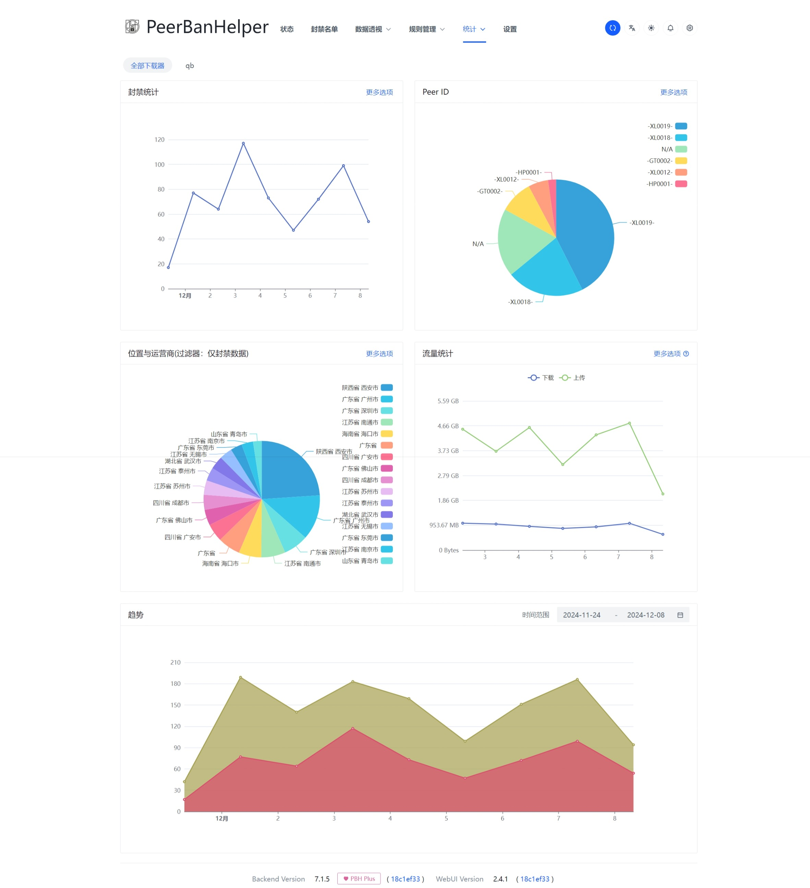

# 图表

图表是 PBH Plus 的功能之一，可以让您直观的查看目前下载器上活动的 Peers 的各类信息。

要查看不同下载器的信息，可在顶部的 TAB 标签栏切换不同下载器标签。

## 封禁统计

显示了在选定时间范围内的封禁曲线。可以在设置中调整要查看的时间区间范围。

## 多维图饼

可以在 PeerID、种子名称、功能模块三个维度切换，查看以下数据：

* 不同 PeerID 的封禁数量
* 哪些种子下的 IP 地址封禁数量最多
* 哪个功能模块在封禁中发挥了最大的作用

## 位置与运营商

这也是个多维图饼，可以查看运营商/AS、国家/地区、省、城市四个维度的数据。  
默认情况下只显示与封禁有关的数据，但也可以切换到所有会话数据。

## 流量统计

:::warning

数据由于采样间隔、计算机制等问题，可能存在偏差。数据仅供参考，如需准确数据，请以下载器的统计数据为准。

BitComet 和 Deluge 暂不支持此功能。

:::

显示了在选定时间范围内的以天为单位的上传、下载流量曲线。可以在设置中调整要查看的时间区间范围。

## 趋势

显示了在选定时间范围内的以天为单位的会话访问和封禁数量的变化趋势。

有时您可能发现封禁数量比会话数量更多，这并不是错误，而是因为 Peer 只有连接到下载器并且产生流量时才会被计算为一次会话，而封禁可以在产生流量前就切断 Peer 的连接。