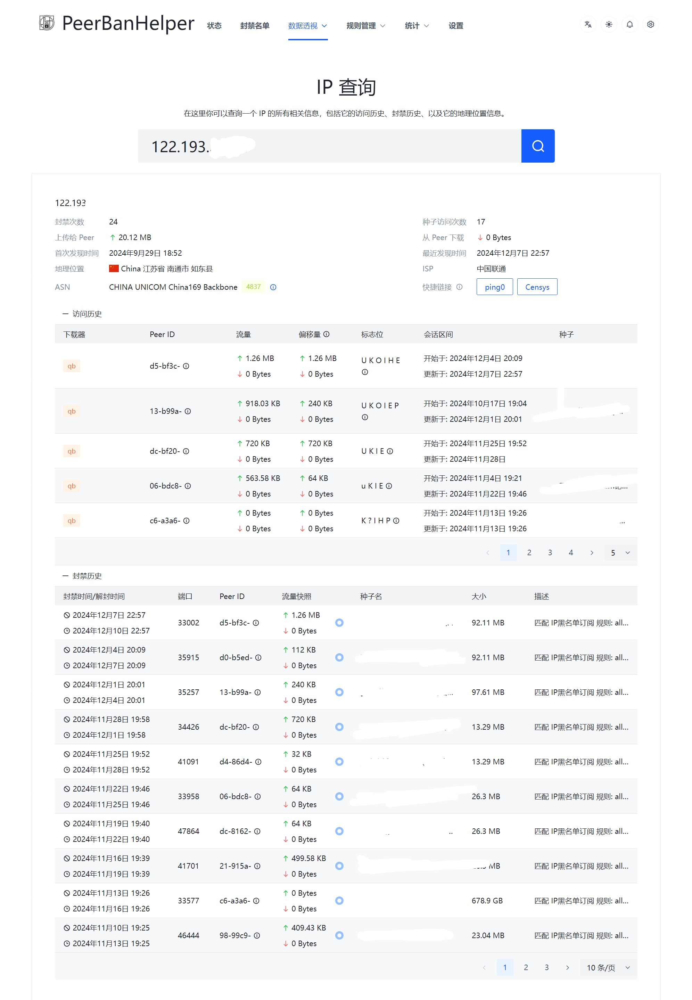

# IP 查询

IP 查询能够查询给定 IP 地址在 PeerBanHelper 的 GeoIP 数据中的记录信息。如果解锁了 PBH Plus，则还会显示此 IP 的封禁历史和访问历史数据。

## 访问历史

启用 [主动检测 Active Monitoring](../module/active-monitoring.md) 后，将会记录访问历史数据。您可以查看该 Peer 造访您的下载器上的不同种子时的统计数据。

## 封禁历史

记录该 IP 地址下所有关联的封禁操作。

## 快捷链接

提供两个很好用的外部 IP 分析工具，可以分析 IP 的异常情况和其上运行的服务。

这两个外部工具均与 PeerBanHelper 或 PBH-BTN 无关，我们也不对其上面的信息负责。