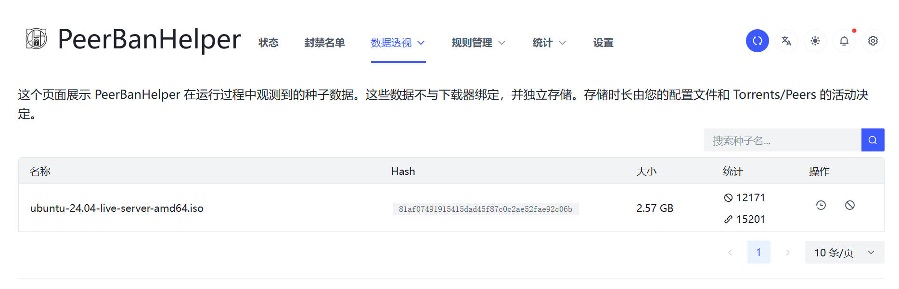
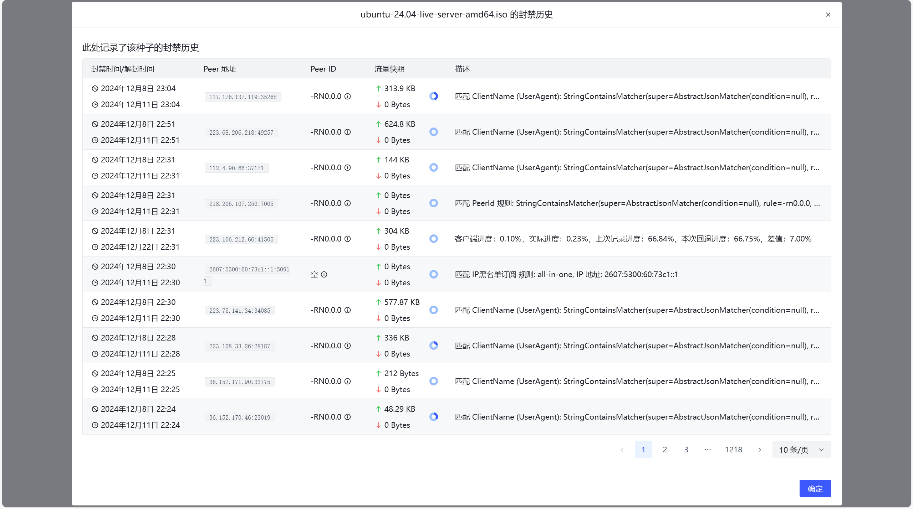

# 种子查询

PeerBanHelper 在运行过程中会记录下载器上活动过的种子的基本元数据（如：名称、infohash 和大小），并缓存在数据库中以供其它模块使用的同时，避免重复记录相同数据，降低硬盘空间的浪费。

种子查询模块利用记录的这些数据，向您展示 PeerBanHelper 关联的种子的连接和封禁情况。

点击要查询的记录的按钮，即可打开记录查询页面，上面记录了所有此种子下关联的访问或封禁记录。

:::tip

尽管并非本意，但如果您的下载器暴毙，保存的种子全部丢失，你可以通过这里记录的哈希值，重新组合成磁力链接，重新下载元数据。

:::