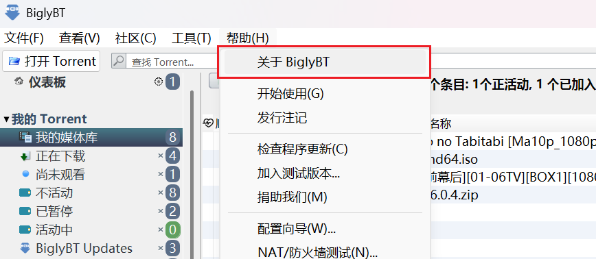
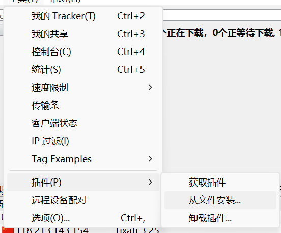
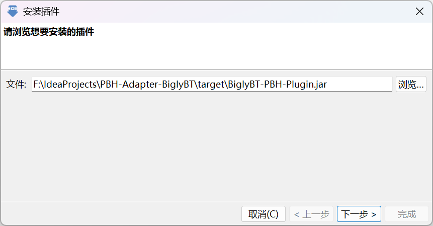
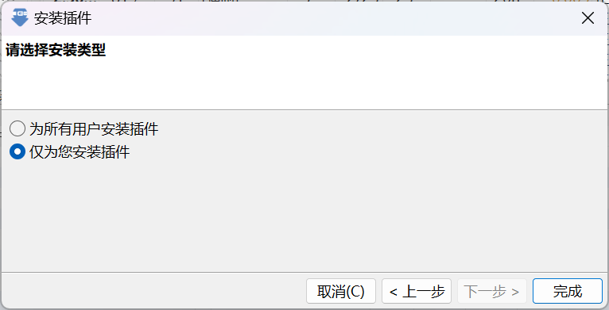
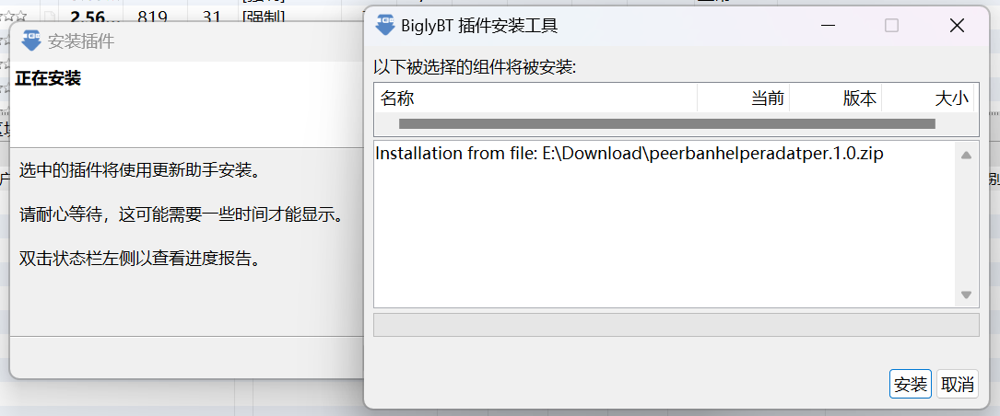
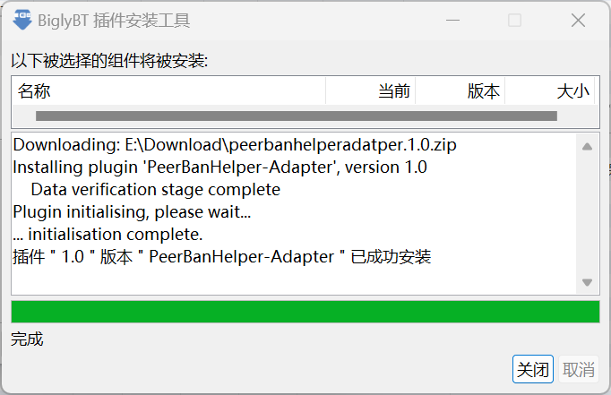
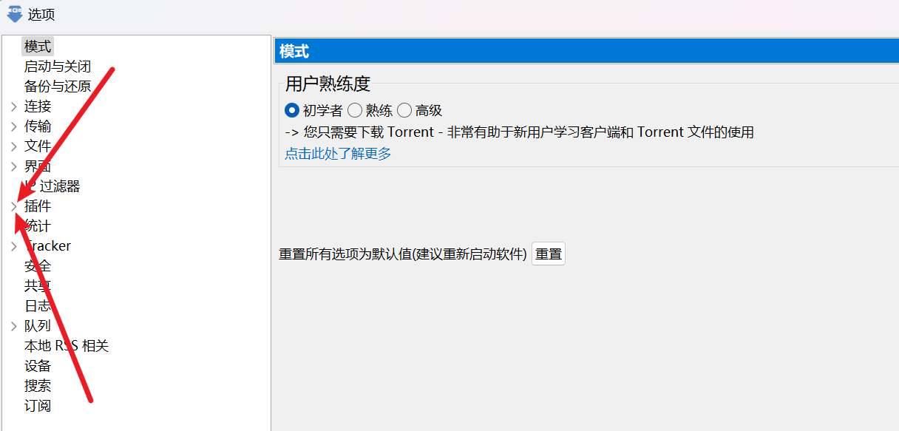
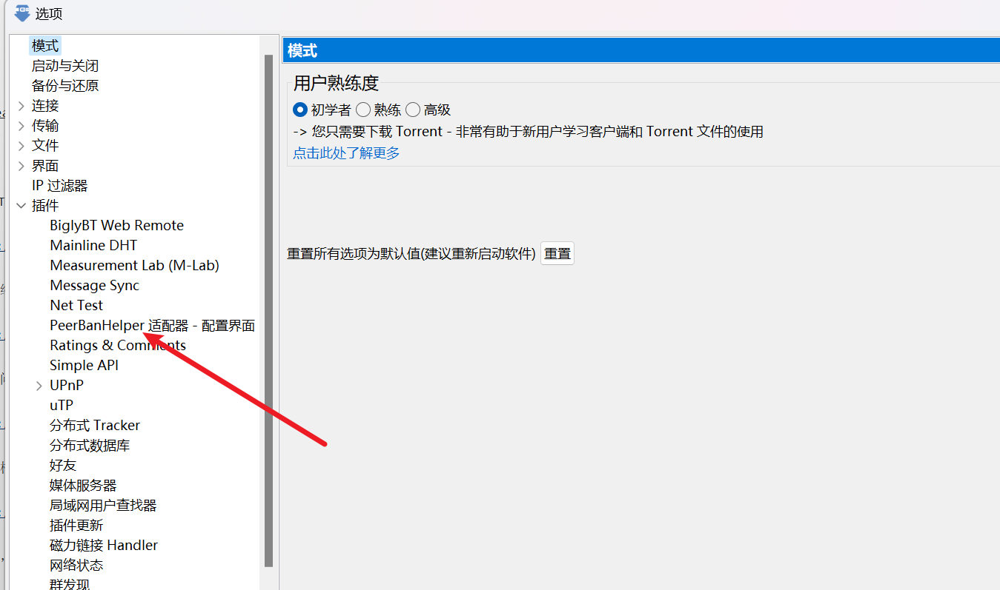
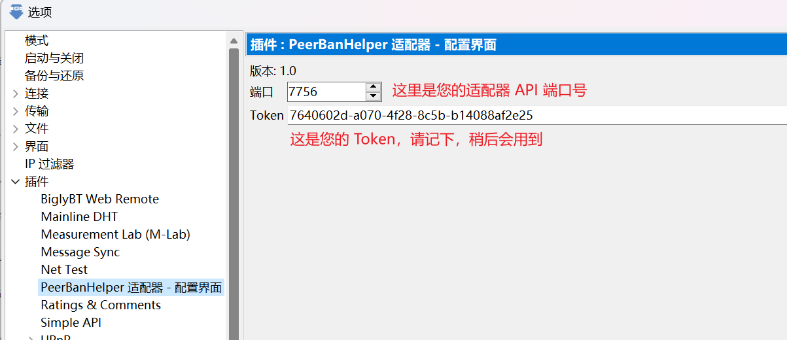
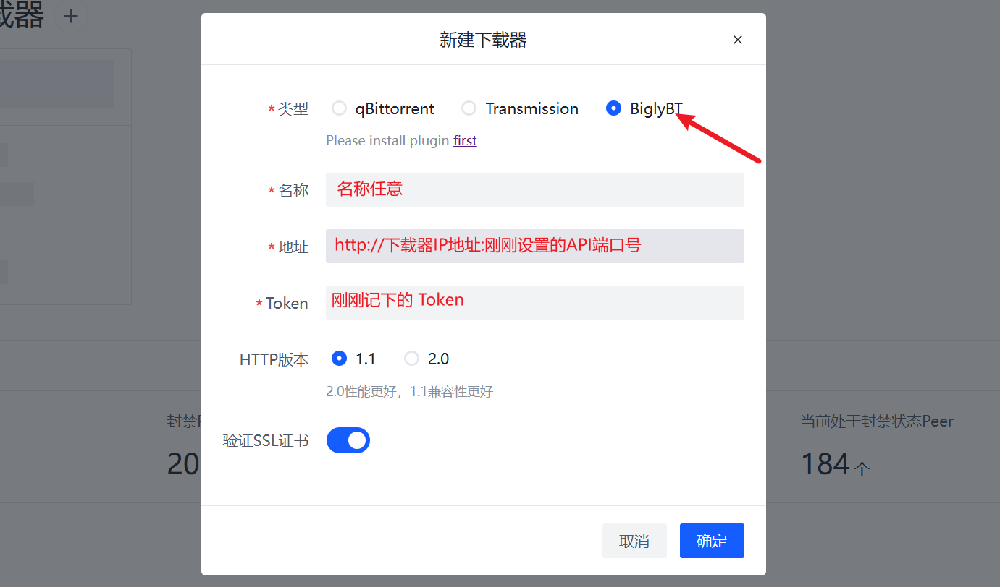

# BiglyBT/Azureus(Vuze)

:::warning

All downloaders that deploy in Docker MUST use host network mode to make sure downloader can get correct incoming connection IP address, bridge will break it and not supported. PeerBanHelper may not working if you downloader not in correct network mode.

:::

:::tip

PeerBanHelper is fully compatible with BiglyBT and provides optimal support.

:::

PeerBanHelper connects to BiglyBT using BiglyBT's plugin system.

Please note that your BiglyBT must be running Java version 11 or higher. If you're using Java 8 or an older version, it won't work, and you'll need to [switch your Java version](https://github.com/BiglySoftware/BiglyBT/wiki/Java-Versions).

## Verify BiglyBT's Java Version

1. Click the "Help" menu in BiglyBT/Vuze/Azureus and select "About BiglyBT/Vuze/Azureus."
2. Check the "System Information" window on the right-hand side for the version number after `Java`. If it shows `8` or `1.8`, it is not supported, and you will need to upgrade your Java version.

## Upgrade Java Version (if needed)

If you're unfortunate enough to be stuck with Java 8, you will need to upgrade your Java version.

Upgrading is simple. First, download Java 21 JDK from [Azul Zulu](https://www.azul.com/downloads/?version=java-21-lts&os=windows&architecture=x86-64-bit&package=jdk#zulu). This link will automatically filter the appropriate JDK for your system. Download and install it.

## Install PBH-BiglyBT/PBH-Azureus Adapter

Download the BiglyBT adapter: [PBH-BTN/PBH-Adapter-BiglyBT](https://github.com/PBH-BTN/PBH-Adapter-BiglyBT/releases). Choose the JAR file ending in `.jar` when downloading.  
Download the Azureus/Vuze adapter: [PBH-BTN/PBH-Adapter-Azureus](https://github.com/PBH-BTN/PBH-Adapter-Azureus/releases).

The installation process is similar for both.

Go to "Tools -> Plugins -> Install from File..."

Select the downloaded JAR file and proceed with the installation.

If BiglyBT asks who to install the plugin for, choose based on your preference. If unsure, select the default option.

When the plugin installation dialog appears, click the "Install" button.

If a security warning pops up, allow the installation to continue.

Once the installation is complete, the PeerBanHelper BiglyBT Adapter is ready. Follow the steps below to configure it.

## Configure PBH-BiglyBT/PBH-Azureus Adapter

For security purposes, PBH-Adapter-BiglyBT generates a random token. You will need this token to connect PeerBanHelper to your BiglyBT client.

Click "Tools -> Options" to open the options window. Expand the plugin configuration menu by clicking the triangle icon next to "Plugins."

Find "PeerBanHelper Adapter - Configuration Interface" and click to enter the configuration page.

Set the API port number and note the token. **Make sure to click the save button; otherwise, the token will regenerate after restarting.**

## Connect to PeerBanHelper

When adding a downloader, select BiglyBT (Azureus/Vuze users should also choose this option).

Choose "BiglyBT" and enter the port number and token you noted earlier:

Click save to complete the setup.
