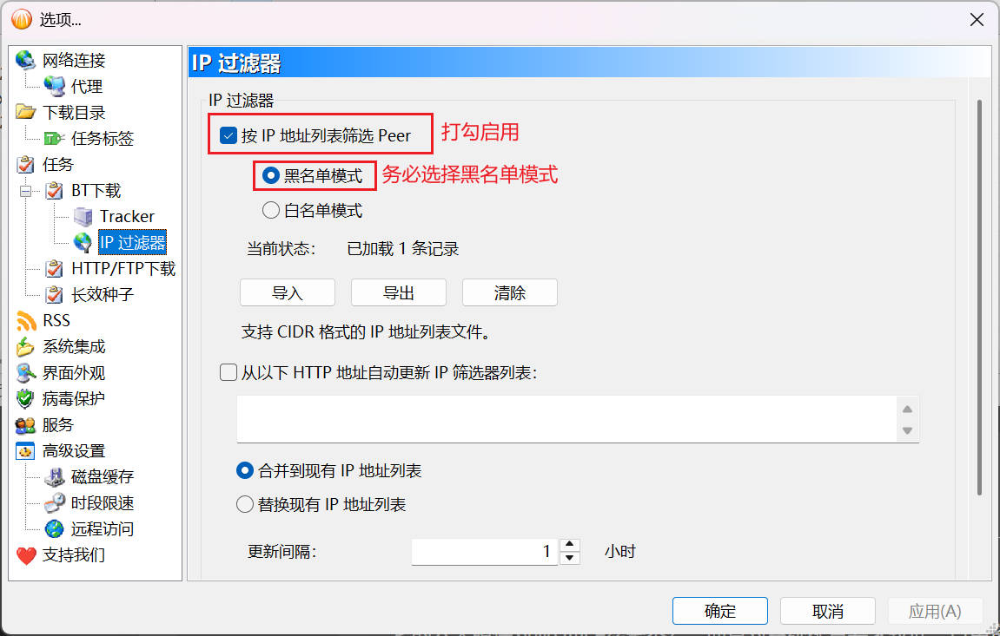
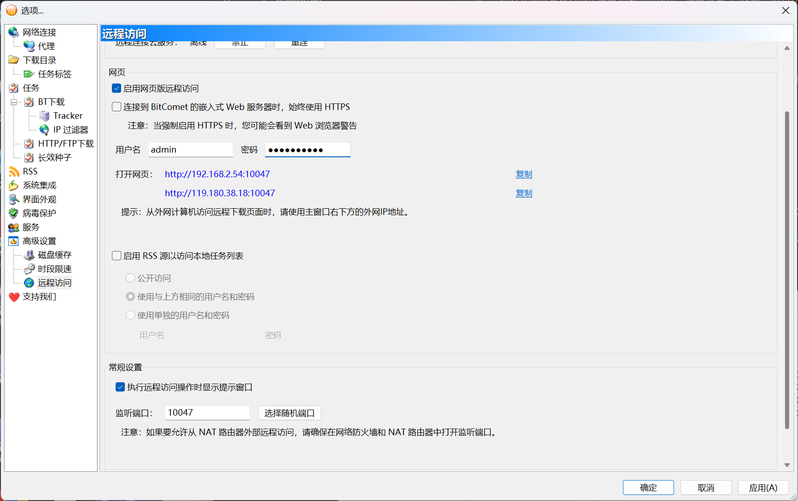
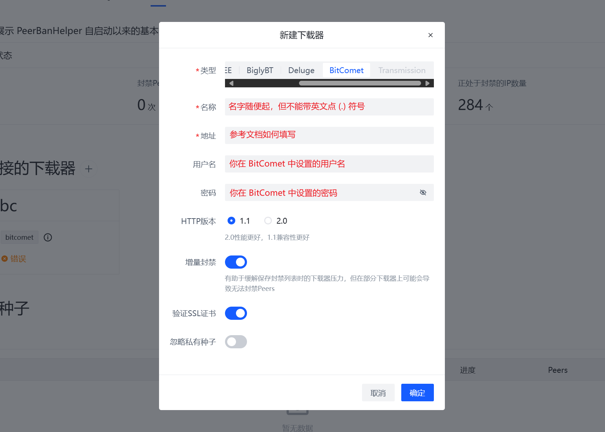

# BitComet

:::warning

All downloaders that deploy in Docker MUST use host network mode to make sure downloader can get correct incoming connection IP address, bridge will break it and not supported. PeerBanHelper may not working if you downloader not in correct network mode.

:::

PeerBanHelper interacts with BitComet using the BitComet WebAPI. This chapter will guide you on enabling the WebAPI for BitComet and connecting PeerBanHelper to BitComet.  

## Notice

:::danger

Special Note: Support for BitComet is currently highly experimental, and there are no guarantees regarding ban effectiveness or stability.

:::

BitComet users may frequently encounter the message "The peer being banned is already in the ban list." This issue arises because BitComet processes bans asynchronously. You can safely ignore this warning unless it appears continuously without stopping.  
If you see errors like "Ban thread unresponsive" or "Unable to retrieve peers," these are typically caused by BitComet's WebAPI timeout issues. This problem has been reported to BitComet but remains unresolved. You don't need to worry, as PBH will retry in the next ban process.

## Verify Version

The WebAPI required by PeerBanHelper is only available in `v2.10 Beta6 [20240928]` or later. As of this writing, the v2.10 stable version has not yet been released. Once it is, you should use v2.10 or a later stable release.  
Any earlier versions of BitComet are unsupported and will not work.

## Enable IP Filter

Open the BitComet settings interface by selecting "Tools -> Options." In the settings window, expand the left-side menu tree under "Tasks -> BT Download -> IP Filter." On the filter configuration page, check "Filter peers using IP list" and select "Blacklist mode."

## Configure Multi-Connection Ban

Allowing multiple connections disrupts PBH's anti-cheating mechanism and must be disabled.

In the settings window, navigate to "Advanced Settings" in the left-side menu tree, find `bittorrent.multi_peers_same_ip`, and set its value to "No."

## Disable WebUI Speed Limits

By default, the WebUI is affected by network speed limit settings, which can hinder PBH's performance when accessing the BitComet WebAPI, leading to failed bans and delays. This limitation must be disabled.

In the settings window, navigate to "Advanced Settings" in the left-side menu tree, find `network.ignore_remote_access_in_speed_limit`, and set its value to "Yes."

| Older Version | Newer Version |
| ------- | ------- |
|  |  |

## Enable Remote Access

PeerBanHelper requires the remote access feature to connect to BitComet. This feature is disabled by default and needs to be manually enabled.

In the settings window, navigate to "Advanced Settings -> Remote Access," check "Enable Web Remote Access," and set a username and password.  
Scroll down to find the port number setting and note the displayed port number.

After completing these configurations, remember to save them.

## Add BitComet in PeerBanHelper

Open the downloader addition window in PeerBanHelper and select the BitComet type.

The address depends on your setup:

* If BitComet and PeerBanHelper are on the same device, use `http://127.0.0.1:port_number`, replacing `port_number` with the port you noted earlier.
* If BitComet and PeerBanHelper are on different devices, use the address shown in the "Advanced Settings -> Remote Access" interface of BitComet, below the username and password fields.

Finally, save the configuration. Once the connection test passes, you're all set to use it.
