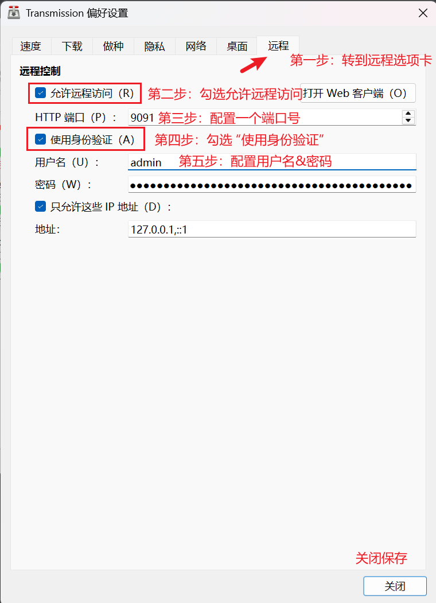
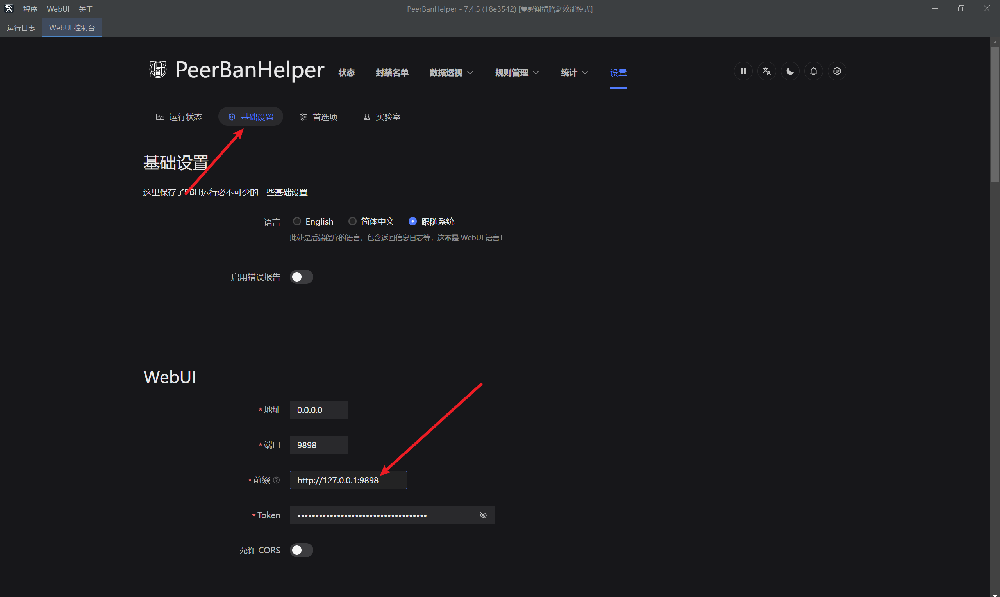

# Transmission

:::warning

All downloaders deployed in Docker must not use bridge network mode, and must use host network mode to ensure the downloader can obtain the correct Peer inbound address. Otherwise, PeerBanHelper will not work at all!

:::

Only Transmission v4.1.0-beta2 or newer versions can be added and supported. There are no exceptions. Please don't ask if a certain version can be supported. Anything lower than v4.1.0-beta2 won't work!

For users using Transmission on Linux and Docker, you probably have already configured WebUI, so you can skip the previous steps.

## Enable WebUI

1. Click the "Edit" menu, enter "Preferences", and switch to the "Remote" tab
2. Check "Enable remote access"
3. Check "Use authentication" and configure a username and password
4. Click close




## Configure PeerBanHelper Blocklist Provider Endpoint

Since Transmission's blocklist update method is active pulling rather than PeerBanHelper pushing to it, you need to configure a "blocklist provider endpoint" to provide HTTP service to Transmission for the blocklist.  
Don't worry though, PeerBanHelper has already done this for you. PBH's WebUI HTTP server can also serve this role. This way, whenever there are any changes to the blocklist, PeerBanHelper will automatically update and notify Transmission to pull.

You need to open PeerBanHelper's WebUI and go to "Settings -> Basic Settings -> WebUI -> Prefix", and set it to an address where Transmission can access PeerBanHelper WebUI.



For normal environments where PeerBanHelper and Transmission are installed on the same device, same system, and without container isolation, the prefix is fixed as:

```plain
http://127.0.0.1:<PBH WebUI Port>
```

For example:

```plains
```

Note: Don't end with a forward slash.  
After saving the configuration, try adding the Transmission downloader. If it can be added successfully, the configuration is correct.

## Add Transmission to PeerBanHelper

1. Open the "Add Downloader" window
2. At the top, select "Transmission" as the downloader type
3. The name can be anything you want, just don't include periods (`.`)
4. For the address, enter the URL to access Transmission's WebUI with the port you configured above. Be careful not to end with a `/`
5. Username is what you set in the "Authentication" settings above
6. Password is what you set in the "Authentication" settings above
7. Click OK, and if successful you'll see a success message
