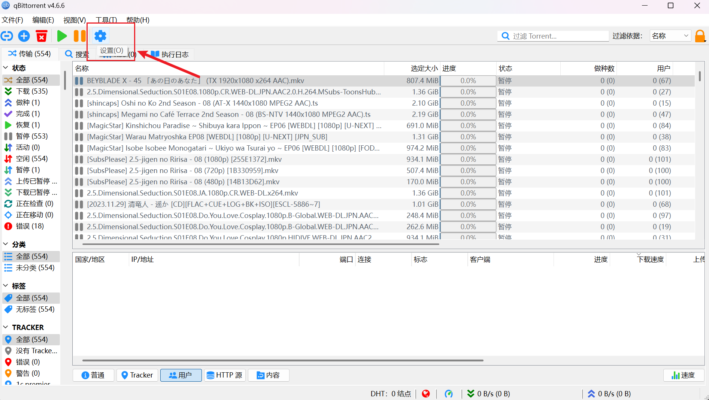
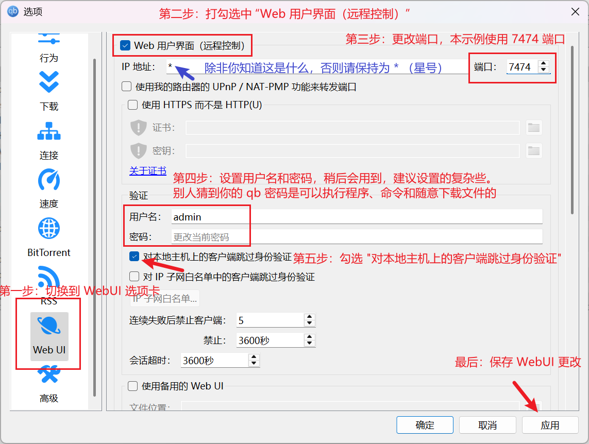

# qBittorrent

:::warning

All downloaders that deploy in Docker MUST use host network mode to make sure downloader can get correct incoming connection IP address, bridge will break it and not supported. PeerBanHelper may not working if you downloader not in correct network mode.

:::

PeerBanHelper leverages the WebAPI of qBittorrent to interact with it. This chapter will guide you on how to enable the WebUI for qBittorrent and successfully connect it to PeerBanHelper. For users using qBittorrent in Linux or Docker environments, if your WebUI is already configured, you can skip through the relevant steps.

## Enable WebUI

Click on the gear icon at the main page to open the settings menu.

Next, follow these steps:

1. Switch to the "WebUI" tab in the left sidebar.
2. Check the box for "Enable Web User Interface (Remote Control)".
3. Configure a port number; we use `7474` as an example. Note that the term "IP Address" here refers to the "Listen Network Card Address". If you're unsure about its meaning, keep it at the default of `*`, but ensure your firewall is configured correctly so that only necessary ports are accessible.
4. In the "Authentication" section, set a username and a strong password. If someone guesses the password, they might access qBittorrent's download files or execute commands/programs.
5. Finally, click on the bottom-right button to apply the settings.

:::warning
**Security Tip**
- Set strong passwords to protect your qBittorrent.
- If you only use it locally, consider restricting access to `127.0.0.1`.
- Ensure that your firewall is configured correctly and only allows necessary ports.
:::

## Configure Advanced Options

In addition to enabling WebUI, some configuration adjustments are needed for PeerBanHelper to function properly:

1. Switch to the "Advanced" tab in the left sidebar.
2. Scroll down to the "libtorrent-related" section and uncheck the option titled "Allow multiple connections from the same IP address". 

:::tip
Starting with version `v7.2.0`, qBittorrent will automatically disable the "Allow multiple connections from the same IP address" option when a downloader connects to PBH, so you needn't to manually configure it if your version is correct.
:::

## Add qBittorrent Downloader in PeerBanHelper

Follow these steps to add the downloader:

1. Open PeerBanHelper's Add Downloader window.
2. In the top-down list of downloader types, select "qBittorrent".
3. You can leave the name field empty but ensure it doesn't contain a period (`.`).
4. In the address bar, enter `http://localhost:7474`, where `7474` is the port number you configured earlier. When entering the URL, make sure not to end with a forward slash (`/`).
5. For the username and password, use the credentials set in the "Authentication" section.
6. Click on the "OK" button to confirm; if prompted successfully, it indicates that the addition was successful.

