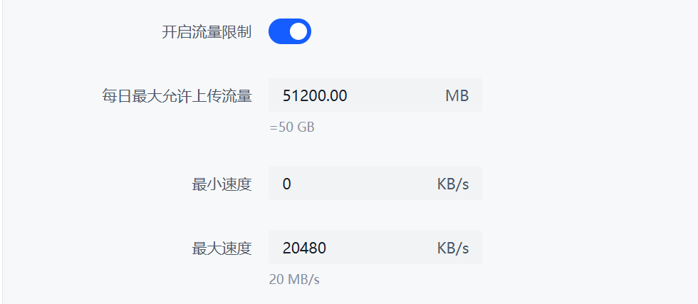

# Active Monitoring

Some of the statistical features provided by PBH require this module to be enabled.  
When active monitoring is enabled, PBH will store and update all Peers data obtained during each scan of the downloader into the database to provide visual statistics and traffic alert services.  

It is not recommended to enable this feature for users with EMMC chips or SD cards. Besides affecting performance, it may also accelerate flash memory wear.  

Transmission and BitComet users may have missing data due to API limitations.

## Features Supported by This Function

* Traffic statistics charts
* Trend charts
* Non-blocked part of the GeoIP charts

## Configure Traffic Alerts

Go to Settings -> Preferences, scroll down to find "Active Monitoring," enable traffic alerts, and configure the daily traffic alert threshold.


After configuring, click the "Save" button at the bottom of the page to apply the changes.

## Configure Traffic Limiting

Go to Settings -> Preferences, scroll down to find "Active Monitoring", enable traffic limiting and configure daily traffic limits.

After enabling traffic limiting, you need to keep PeerBanHelper running continuously and ensure your downloader supports traffic data statistics. Once enabled, PeerBanHelper will dynamically adjust the downloader's speed limits between the maximum and minimum upload speed limits you've set, based on the upload traffic over the past 24 hours, ultimately controlling it near the specified total upload amount.



## Peer Data Recorded

For IP-torrent records, each IP connected to a different torrent is considered a separate session.

* Session IP address
* Session Torrent metadata
* Session downloader name
* Last used Peer ID in the session
* Last used Peer ClientName in the session
* Total data uploaded to Peer during the session
* Last recorded downloader statistics for uploaded data in the session
* Total data downloaded from Peer during the session
* Last recorded downloader statistics for downloaded data in the session
* Peer flags when the session was last seen
* Session start time
* Session last update time

## Configuration File

```yaml
  # 主动监测 - Active Monitoring
  # 此功能允许 PeerBanHelper 主动记录每次请求下载器时获取到的数据到本地 SQLite 数据库中
  # Allow PBH records all data that fetched from downloader and save them into SQLite database
  # 其产生的数据可被其它模块调用（如：生成图表报表等）
  # The data produced by this module can be re-used by other modules
  # 注意：使用 SD 卡或者 EMMC 的设备【不建议】开启此功能，此功能对于存储设备的读写压力较高，可能加快 Flash 存储芯片磨损或导致存储设备过热
  # NOTE: It is not recommended to enable this module if PBH running on SDCard or EMMC Flash chip.
  # 另请注意：此功能可能还会导致本地数据库文件大小快速变大，不建议在存储空间不充足的存储设备上使用此功能
  # NOTE: This may lead database size increase quickly
  active-monitoring:
    # 是否启用此功能
    enabled: true
    # 清理周期
    # Retention time
    # 请注意：由于 SQLite 的特性，记录被删除后不会释放磁盘空间，但后续新数据记录会重新利用此部分空间
    # Note: Deleted records won't free the disk space, but new data will reuse those parts of space due SQLite internal design
    # 因此请选择一个合理的记录周期
    # 时间单位：ms；默认值：5184000000 (60 天) ; default: (60 days)
    data-retention-time: 5184000000
    # 清理检查周期
    # Cleanup check interval
    # 每 interval 毫秒后，将进行一次数据清理任务
    # Period of cleanup task will be run
    # 建议不要设置的太频繁，SQLite 是单线程数据库，无法同时执行多个 SQL 查询，慢查询可能导致 PBH 数据写入延迟/耗尽运行 RAM
    # Do not set it run too frequently
    # 时间单位：ms；默认值：604800000 (7 天); default: (7 days)
    data-cleanup-interval: 604800000
    # 流量监控 - Traffic Monitoring
    # 设置流量封顶阈值，当超出阈值后将发送告警信息提醒您检查下载器状态
    # Set the traffic capping threshold, when the threshold is exceeded, an alert message will be sent to remind you to check the status of the downloader.
    traffic-monitoring:
      # 每日阈值 - 设置为 -1 以禁用，单位：bytes
      # Daily threshold, set to -1 to disable, Unit: bytes
      daily: -1
```