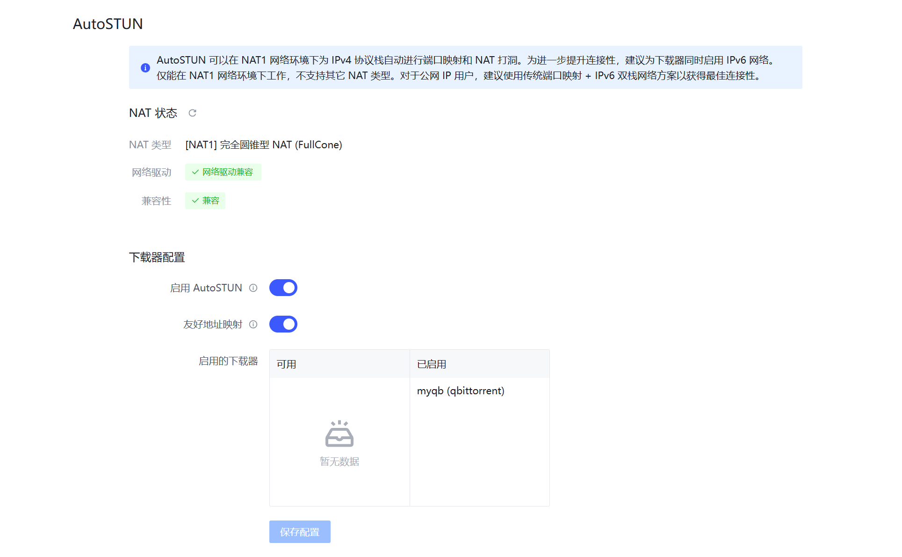

# Auto STUN

Provides automated NAT traversal for private NAT1 users without public IP addresses, opening a port on the NAT gateway to achieve near-public connectivity.

## Why use AutoSTUN?

PeerBanHelper is not affected by the loss of original IP addresses caused by user-space forwarding through AutoSTUN-created connections, and can automatically restore the correct IP information. It can also directly block connection attempts to the tunnel entrance from banned IPs.
Additionally, PBH provides a concise and intuitive connection status table for quick statistics and GeoIP information of tunneled connections.

Best of all, once configured correctly, all subsequent maintenance is fully automated.

:::info
PeerBanHelper uses user-space forwarding, which may consume significant processing resources on low-end devices when handling large traffic volumes.  
If you have a public IP address, use traditional port forwarding. If you know how to configure your system firewall, it is recommended to use the Lucky tool's firewall forwarding method. Kernel-space forwarding not only preserves the original IP address, but also offers better performance and results than PeerBanHelper's solution.
:::

:::warning
In principle, it is not recommended to use AutoSTUN while running PeerBanHelper and your downloader on different networks/devices. If you cannot access from 127.0.0.1, effectiveness may be greatly reduced.

This feature is only available for users with **NAT1** network type.
:::

## How to determine if you can use AutoSTUN

To use AutoSTUN, first check if your network is public (not recommended for public networks) and if your NAT type is *NAT1* (only NAT1 is supported).  

If you are a public IPv4 user: **AutoSTUN is not recommended**. Please configure port mapping and firewall directly for best connectivity. Specific query methods are beyond the scope of this document.

Go to "Settings -> Lab -> AutoSTUN". If all status icons are green, you can use AutoSTUN.

If not green, refer to the troubleshooting guide below for the problematic module.

## Docker Network Driver Troubleshooting Guide

If PeerBanHelper's network driver test fails, change the container's network mode from "bridge" to "host".  
For docker-compose users, get the latest docker-compose file from the [Docker Installation Guide](../setup/Docker.md), which is pre-configured.  
For CLI users, please configure manually as needed.

## NAT Type Troubleshooting Guide

To make PeerBanHelper's AutoSTUN work, the NAT type must be "[NAT1] Full Cone NAT", which is a strict technical requirement.

### 0. What factors affect NAT type?

* ISP - Only they can provide NAT1. For example, China Mobile only offers NAT3/4.
* Optical modem - ISPs may set firewalls, preventing devices from obtaining NAT1.
* Router - If there is a router or gateway, devices not in DMZ or without UPnP forwarded ports may be restricted, preventing NAT1.
* System - Built-in firewalls may block traffic if not disabled.
* Antivirus/Security software - Products like Kaspersky may take over the firewall, blocking traffic.
* Docker network - Host mode is required; default bridge mode breaks NAT.

### 1. Check if your ISP provides NAT1

Generally, *China Telecom* and *China Unicom* public broadband services usually provide NAT1, and some regions even offer public IPs. If you use *China Mobile*, you can close this page.  
If you use IoT SIM cards or mobile data, you can also close this page.

### 2. Test network access at the topmost network device

Connect your computer directly to the optical modem with a cable. If you can access the internet, it's router mode (see 2.1). If not, it's bridge mode (see 2.2).

#### 2.1. Router Mode Optical Modem Adjustment

Due to many models and configurations, steps may vary, but generally:

1. Confirm ISP provides NAT1. If not, further steps are not technical.
2. If ISP provides NAT1 but devices behind the modem do not, set firewall level to "Low" and enable UPnP in the modem.
3. If possible, assign a static IP to your computer and set it as DMZ host.

Retest to check for NAT1.

#### 2.2. Bridge Mode Router Adjustment

Connect your computer and modem; if you **cannot access the internet**, then connect the modem to a router and ensure you **can access the internet**—this confirms bridge mode.

Routers vary, but general steps:

1. Set a fixed IP for your computer in the router (usually "DHCP static address" or "IP/MAC binding").
2. Set the new IP as DMZ host.
3. Enable UPnP on the router.

Refer to your router's manual for details.

**Disconnect and reconnect** to retest for NAT1.

### 3. Local Firewall Settings

After confirming NAT1, configure your device firewall.  
Since STUN-mapped ports may change, you cannot fix the port number, so:

* For Windows exe users: The installer will auto-configure Windows Firewall; just ensure your antivirus (e.g., Kaspersky) does not block it.  
* For Linux docker users:
  * Set docker to host mode
  * Disable system firewall (methods vary: usually ufw/firewalld/iptables)
* For Synology DSM NAS users:
  * Disable firewall: Control Panel -> Security -> Firewall, uncheck "Enable Firewall"
  * Or set to blacklist mode:
    * Control Panel -> Security -> Firewall
    * Edit firewall profile rules
    * For "All interfaces", find the network port connected by cable (set each if multiple)
    * Change "If none of the above rules match:" to "Allow access"

:::danger
Disabling or opening the firewall **seriously reduces security**. Firewalls protect your devices; once disabled, previously NAT-protected devices may be fully exposed to hundreds of attacks per second.  
Before doing this, harden your internal services and properly configure the firewall to explicitly block external traffic to critical services and ports.
:::

After completing all steps, restart PeerBanHelper. If all status indicators are green, AutoSTUN should work properly.

