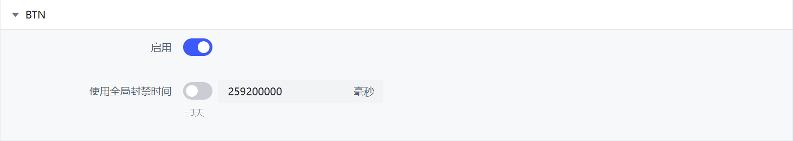

# BTN Cloud Rules

Use cloud rules from the BTN network. You need to [configure PBH to connect to BTN](../btn/connect.md) in advance.

If only BTN is connected but the BTN rules module is not enabled, only upload data will be submitted, and BTN cloud rules will not be used.



## Configuration File

config.yml
```yaml
# BitTorrent Threat Network 威胁防护网络（测试版）
# BitTorrent Threat Network (BETA)
btn:
  # 启用 BTN 模块
  # 启用后，才可以使用由 BTN 提供的云规则功能
  # 为了隐私起见，此功能需要您手动启用
  # Enable BTN module, all settings below will only take effects if you turn this on.
  enabled: false
  # 启用数据提交
  # BTN 网络基于所有启用此功能的用户提交的数据，对 Peers 进行可信度验证
  # 通过启用此选项，您也会加入 BTN 网络并提交您的 Torrent 上的活动
  # 以下信息将被发送到 BTN 实例；
  # 您的 Torrent 列表（包括：Torrent 种子摘要的二次不可逆哈希和 Torrent 大小）
  # 连接到您的 Torrent 的所有 Peers （包括：IP地址、端口号、PeerID、UserAgent（ClientName），Peer协议，Peer总下载量，Peer总上传量，Peer瞬时上传速度，Peer瞬时下载速度，Peer下载进度，以及您的下载器名称）
  # 封禁列表
  # Allow data submitting
  # If this option is enabled (and module also enabled), PBH will generate send data to BTN server including:
  # Your torrent lists (torrentIdentifier and torrent size, but not include: info hash, name)
  # All peers connected to torrents (Including: IP, Port, PeerID, UserAgent, Peer Protocol, Flags, Uploaded, Downloaded, UploadRate, DownloadRate, PeerProgress, YourProgress and Downloader Name)
  # Your banlist
  submit: true
  # 部分 BTN 实例可能要求您登录验证以确认您的身份或下发不同的配置文件。如果是这样的话，您需要在下面输入凭据信息
  # 如果 BTN 实例未要求您登录验证，则通常不需要填写
  # Some BTN instance may require your authentication, if so, you can fill the credentials here
  app-id: "example-app-id"
  app-secret: "example-app-secret"
  # 填写实例 URL，您需要自行寻找一个 BTN 实例服务器
  # 默认使用 PBH-BTN 社区 BTN 服务器，请前往 https://btn-prod.ghostchu-services.top 注册并获取一个账号
  # The BTN instance URL, you need find a BTN instance
  # By default, PBH-BTN official BTN instance will be used
  config-url: "https://sparkle.ghostchu.com/ping/config"
  # 是否允许 PeerBanHelper 接收来自 BTN 服务器的 Aviator 脚本
  # 请仅在受信任的 BTN 服务器上启用此功能，运行来自未知来源的脚本可能会导致设备遭到攻击
  # Allow PeerBanHelper to receive Aviator script from BTN server
  # Enable this option only on trusted BTN server, running script from unknown source may cause your device under attack
  allow-script-execute: false
```

profile.yml
```yaml
  # 启用来自 BTN 网络的规则
  # Enable the network rules from BTN server, only works when you configured BTN server in config.yml
  btn:
    enabled: true
    # 封禁时间，单位：毫秒，使用 default 则跟随全局设置
    ban-duration: 259200000
```