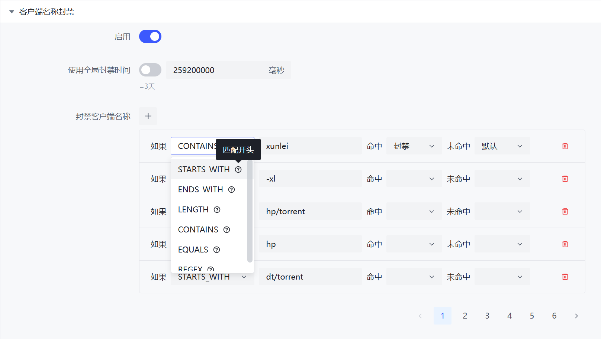

# ClientName Filter

The ClientName filter uses the ClientName actively reported by the Peer (sometimes called "client name" or "UserAgent") for detection. It is recommended to prioritize using the built-in ClientName filtering functionality of clients with an embedded PeerID filter (e.g., qBittorrent Enhanced Edition).  
Note that the ClientName is actively reported by the Peer (and can be arbitrarily modified), so it should not be used as the sole basis for determining the client type.

ClientName is an [extended protocol](https://www.bittorrent.org/beps/bep_0010.html) of BitTorrent, so a Peer may not have a ClientName. In such cases, PeerBanHelper will display it as `N/A`.

## Configuration File

The rules use the [JSON Rules Engine](../misc/json-engine.md) syntax. You can control the banning behavior by writing JSON rules. However, for simple bans and exceptions, you can complete them through the WebUI.



```yaml
  # 客户端名称封禁
  # ClientName blacklist
  client-name-blacklist:
    enabled: true
    ban-duration: 259200000
    banned-client-name:
      - '{"method":"CONTAINS","content":"xunlei"}'
      - '{"method":"STARTS_WITH","content":"-xl"}'
      - '{"method":"STARTS_WITH","content":"hp/torrent"}'
      - '{"method":"STARTS_WITH","content":"hp "}'
      - '{"method":"STARTS_WITH","content":"dt/torrent"}'
      - '{"method":"STARTS_WITH","content":"dt "}'
      - '{"method":"STARTS_WITH","content":"xm/torrent"}'
      - '{"method":"STARTS_WITH","content":"xm "}'
      - '{"method":"STARTS_WITH","content":"taipei-torrent"}'
      - '{"method":"CONTAINS","content":"rain 0.0.0"}'
      - '{"method":"CONTAINS","content":"gopeed dev"}'
      - '{"method":"STARTS_WITH","content":"xfplay"}'
      - '{"method":"CONTAINS","content":"StellarPlayer"}'
      - '{"method":"CONTAINS","content":"SP "}' # 不要删除尾随空格
      - '{"method":"CONTAINS","content":"flashget"}'
      - '{"method":"CONTAINS","content":"tudou"}'
      - '{"method":"CONTAINS","content":"torrentstorm"}'
      - '{"method":"CONTAINS","content":"qqdownload"}'
      - '{"method":"STARTS_WITH","content":"qbittorrent/3.3.15"}'
      - '{"method":"STARTS_WITH","content":"github.com/thank423/trafficconsume"}'
      - '{"method":"STARTS_WITH","content":"ޭ__"}' # 0xde-0xad-0xbe-0xef
      - '{"method":"STARTS_WITH","content":"-XL"}'
```