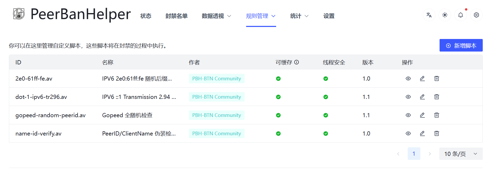
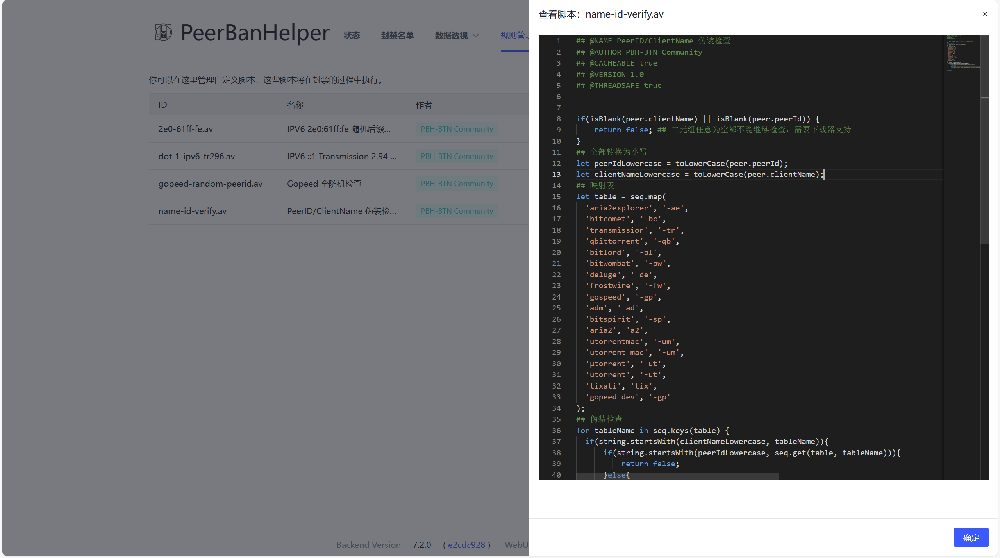

# AviatorScript Engine

PeerBanHelper allows users to load [AviatorScript user scripts](https://www.yuque.com/boyan-avfmj/aviatorscript/cpow90).

## Overview

AviatorScript allows users to load a user script to execute custom code when PBH detects a Peer. It supports advanced operations like reflection and instance creation, offering full programming capabilities.  
Sometimes, when PBH encounters a new variant and cannot release a new PBH version, AviatorScript scripts are made available to the community so that checks and bans can be performed without updating PBH.

## Installing AviatorScript Scripts

AviatorScript scripts end with `.av`. Simply place them in the `data/scripts/` directory to load them.  
If you have a local installation, you can manage the scripts directly through the WebUI.



Additionally, if you are in an intranet environment, you can directly upload and edit script files.



## Creating AviatorScript Scripts

To make an AviatorScript script loadable by PBH, you need to add metadata at the beginning of the file:

```av
## @NAME PeerID/ClientName Spoof Check
## @AUTHOR PBH-BTN Community
## @CACHEABLE true
## @VERSION 1.0
## @THREADSAFE true
```
### Field Description:

* `@NAME` Script name
* `@AUTHOR` Script author
* `@CACHEABLE` Whether the result can be cached for the same Peer. If your script needs to continually check a Peer (rather than checking it just once), set this to false.
* `@VERSION` Version number
* `@THREADSAFE` Whether the script is thread-safe

### Predefined Variables

Some variables are pre-injected into the AviatorScript runtime before execution, and you can use them directly. See the configuration file for more details.

### Return Values

AviatorScript supports the following return values. Different types and values correspond to different behaviors:

* String: Starts with `@`: skips other user rules with a specified reason. Does not start with @: bans Peer with a specified reason.
* Boolean: `false` = no action; `true` = ban Peer.
* Integer: `0` = no action; `1` = ban Peer; `2` = skip other user rules.
* com.ghostchu.peerbanhelper.module.PeerAction: `NO_ACTION` = no action; `BAN` = ban; `SKIP` = skip other user rules.
* com.ghostchu.peerbanhelper.module.BanResult: Operates based on the description inside the object.

You can check scripts in the `src/resources/scripts` directory for real-world examples.

## Configuration File

```yaml
  # 规则引擎，支持 AviatorScript 语言 - User script, support AviatorScript
  # 提供在 PBH 上自行编程编写规则的能力 - Provide programming ability on PBH
  expression-engine:
    # 规则列表 - Rule lists
    # 在 AviatorScript 执行时，PBH 会注入以下环境变量，您可以自由使用它们：
    # You can feel free use them in AviatorScript files
    # peer - 一个 com.ghostchu.peerbanhelper.peer.Peer 对象，您可以使用这个对象下面的任何属性，这些是您可能用到的：
    # peer - an com.ghotchu.peerbanhelper.peer.Peer instance, you can access any property under this object, these is you might will used
    # peer.peerAddress.ip - 字符串型 IP 地址 - IP address in String
    # peer.peerAddress.port - 整型端口号 - Port in int
    # peer.peerAddress.address - IPAddress 对象，可提供高级功能 -  IPAddress object
    # peer.peerId - 字符串型 PeerID，在不支持的下载器上可能为空字符串，使用 isEmpty 判断 - PeerID in String, may be empty string on not supported downloader, check them with isEmpty
    # peer.clientName - 客户端名称，在不支持的下载器上可能为空字符串，使用 isEmpty 判断 - PeerID in String, may be empty string on not supported downloader, check them with isEmpty
    # peer.downloadSpeed - 您的下载器从该 Peer 下载数据的速率（bytes） - Download rate from Peer
    # peer.uploadSpeed - 您的下载器向该 Peer 上传数据的速率（bytes） - Upload rate to Peer
    # peer.downloaded - 您的下载器从该 Peer 下载的数据的累计数据量（bytes），在不支持的下载器上为 -1 - Downloaded bytes from Peer, -1 on not supported downloader
    # peer.uploaded - 您的下载器从该 Peer 上传的数据的累计数据量（bytes），在不支持的下载器上为 -1 - Uploaded bytes to Peer, -1 on not supported downloader
    # peer.progress - 此 Peer 汇报的自己的下载进度，浮点型数据，0.00=0%，1.00=100% - The percentage that Peer reporting, percent in float
    # peer.flags - 由您的下载器汇报的此 Peer 的 Flags 状态，各下载器对其定义可能有所不同, Peer flags
    # torrent - 一个 com.ghostchu.peerbanhelper.torrent.Torrent 对象，您可以使用这个对象下面的任何属性 - an com.ghotchu.peerbanhelper.torrent.Torrent instance, you can access any property under this object, these is you might will used
    # torrent.id - 在您的下载器内，此 Torrent 的对应内部 ID 标识符 - Torrent Identifier in Downloader internal
    # torrent.name - 此 Torrent 的名称 - Torrent name
    # torrent.hash - 此 Torrent 的 InfoHash，具体是 v1 还是 v2，由您使用的下载器的偏好而定 - Torrent info hash
    # torrent.progress - 您的下载器上，此 Torrent 的任务进度 - Torrent progress on your downloader
    # torrent.size - 此 Torrent 的任务大小 - Torrent size
    # torrent.rtUploadSpeed - 您的下载器上的此任务的当前上传速率（bytes） - Torrent task upload rate
    # torrent.rtDownloadSpeed - 您的下载器上的此任务的当前下载速率（bytes） - Torrent task download rate
    # torrent.hashedIdentifier - 此 Torrent 的匿名哈希标识符 - Torrent identifier (generated by PBH for privacy and BTN usage)
    # peerbanhelper - PBH 主实例 (Main instance)
    # HTTPUtil - 提供脚本对网络的访问能力，但请注意，脚本通常只有 1500ms 的执行时间，网络请求也包含在内 - Util for request network
    # JsonUtil - 提供脚本对 JSON 内容的解析能力 - Util for parse Json
    # IPAddressUtil - 提供将字符串的 IP/CIDR 转换为 IPAddress 对象的工具 - Util for processing IPAddress
    # Main - 启动主类，可用于访问配置文件 - Main instance
    # 对于其它的常用函数，语法等，参见 AviatorScript 文档：https://www.yuque.com/boyan-avfmj/aviatorscript/cpow90
    # For more details, check AviatorScript documentation: https://www.yuque.com/boyan-avfmj/aviatorscript/cpow90
    # 规则引擎支持 AviatorScript 的全部能力，您可以自由使用反射或者动态创建特性
    # PBH support full ability, feel free to use reflect or dynamic creating.
    #
    # 每个规则必须提供一个返回值，PBH 会根据您提供的返回值，决定此 Peer 是否封禁。支持的返回值如下：
    # Every single rule must provide a return code, PBH will determine if we need ban this peer, supported return code listed below:
    #   Boolean: [false=不采取任何操作, true=封禁Peer] - Boolean [false = No action will be taken, true = Peer will be banned]
    #   Integer: [0=不采取任何操作,1=封禁Peer,2=跳过其它用户规则] - Integer [0 = No action will be taken, 1 = Peer will be banned, 2 = Skip other rules]
    #   com.ghostchu.peerbanhelper.module.PeerAction: [NO_ACTION, BAN, SKIP]
    #   com.ghostchu.peerbanhelper.module.BanResult
    #
    # 所有的脚本文件默认放置在 data/scripts 目录内，您也可以修改已有的、或者新建新的脚本文件
    # All script files will put in data/scripts, you can modify exists scripts or create your own scripts/
    # 是否启用
    enabled: true
    # 封禁时间，单位：毫秒，使用 default 则跟随全局设置
    ban-duration: default
```