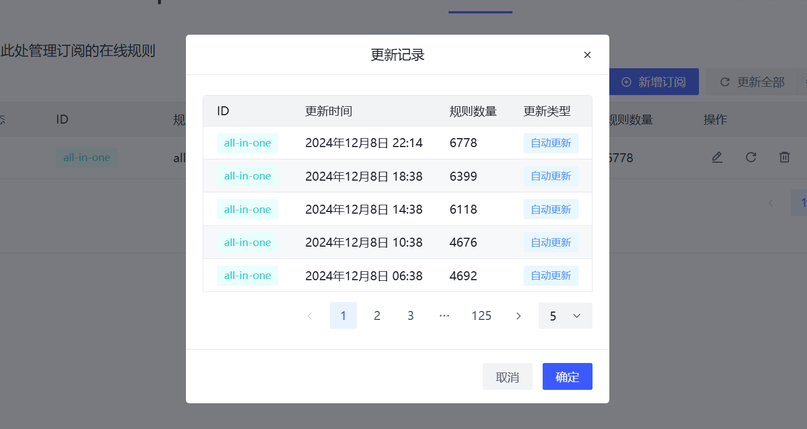

# Subscription Rules

One of the important modules of PeerBanHelper, it subscribes to rules from [PBH-BTN/BTN-Collected-Rules](https://github.com/PBH-BTN/BTN-Collected-Rules) by default.  
When an IP from the rules connects to the downloader, PeerBanHelper will immediately block it.

:::tip
It is not recommended to configure this feature through the configuration file; you can directly use the visual editor in the WebUI.
:::


By default, the rule subscription module updates all subscription rules every time PeerBanHelper starts or every 4 hours. You can click the gear icon to change the update frequency of the subscription rules.

If you need to check the changes in the rules or whether the update was successful, you can click the "View History" button to view the update history.



## Creating Rules

PeerBanHelper can load an IP rule set composed of the following:

* IP addresses (supports v4 and v6), e.g., 1.2.3.4
* CIDR, e.g., 1.2.3.0/24
* Single-line comments starting with `#` (line-end comments are not supported)

## Configuration File

```yaml
  # 订阅规则
  # Rules Subscription
  # 建议在 WebUI 上配置
  # Recommended configure this module on WebUI
  ip-address-blocker-rules:
    enabled: true
    # 封禁时间，单位：毫秒，使用 default 则跟随全局设置
    ban-duration: 259200000
    # 检查间隔
    check-interval: 14400000 # 4小时检查一次 毫秒; Timeunit: ms
    # 规则列表 - Rules list
    rules:
      # 规则ID（任意） - Rule Id(any)
      all-in-one:
        # 是否启用 - Enable?
        enabled: true
        # 显示名称 - Display Name
        name: all-in-one
        # 规则文件订阅地址 - Subscription Address
        url: https://bcr.pbh-btn.ghorg.ghostchu-services.top/combine/all.txt
      tor-exit-nodes:
        enabled: false
        name: Tor Exit Nodes
        url: https://cdn.jsdelivr.net/gh/7c/torfilter/lists/txt/torfilter-1d-flat.txt
```