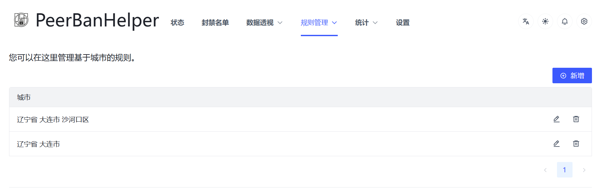

# IP Blocking

Since PeerBanHelper implements Peer blocking by operating the downloader's IP blacklist, your IP blacklist will undoubtedly be overridden by PeerBanHelper. Therefore, PeerBanHelper has a built-in separate IP blacklist feature.

:::tip
It is not recommended to configure this feature through the configuration file; you can directly use the visual editor in the WebUI.
:::

## IPs

IP blacklist, supports entering one or more IP addresses or CIDR addresses. The listed IPs or those included in the CIDR will be banned when connecting to the downloader.

This module accepts both IPV4 and IPV6 addresses, and also supports IPV4 and IPV6 CIDR.


## Ports

Port blacklist, supports entering one or more ports. Any IP using the listed ports to connect to your downloader will be banned.

This feature is rarely used, so no further explanation is provided.

## ASNs

ASN blacklist. It needs to be used with the Maxmind GeoLite2 ASN database. The ASN database should be downloaded along with the IPDB when PBH starts.  
Supports entering one or more [ASN](https://zh-hans.ipshu.com/asn_list), and any IP addresses within the given ASN will be banned when connecting to your downloader.

It is not recommended to use ASN blocking in mainland China, as the AOE range may be too large.

## Regions

Country/Region blacklist. You can enter one or more [ISO 3166-1 two-letter country codes](https://www.rr78.com/World/postal/). It needs to be used with the Maxmind GeoLite2 City database. The City database should be downloaded along with the IPDB when PBH starts.

## Cities

City blacklist. For foreign cities, use the Maxmind city names. For cities recorded in GeoCN (mainland China, some parts of Taiwan, Hong Kong, and Macau), use the standard Simplified Chinese names.  
Using a matching algorithm, as long as the name contains the given keyword, it will be banned:

* `New York` - Bans New York, USA
* `济南` - Bans Jinan City in any province
* `山东省 济南市` - Bans Jinan City in Shandong Province
* `垦利县` - Bans Kenli County in any province or city
* `东营区` - Bans Dongying District in any province or city
* `北京` - Bans Beijing Municipality
* `上海` - Bans Shanghai Municipality



As shown in the figure: the first rule precisely matches Shahekou District, Dalian City, Liaoning Province (other districts are not affected), and the second rule matches Dalian City, Liaoning Province (the entire city will be banned).

If you are unsure of the location (or how to fill it in), you can use the [IP Query](../statistic/ip-query.md) function under the "Data Pivot" menu to query its geographic location.


## Net Type

Network type blacklist. It needs to be used with the GeoCN database. The GeoCN database should be downloaded along with the IPDB when PBH starts.

If the network type of the IP is recorded in the GeoCN database, the IP addresses of the corresponding network type can be banned.

Currently, this setting can only be edited through the configuration file.

## Configuration File

```yaml
  # IP 地址/端口 封禁
  # IP address/port blacklist
  ip-address-blocker:
    enabled: true
    # 封禁时间，单位：毫秒，使用 default 则跟随全局设置
    ban-duration: 259200000
    # 按 IP 封禁，支持 CIDR，其语法大致如下：
    # Banning IP address, support CIDR, syntax example:
    # ::/64
    # a:b:c:d::a:b/64
    # a:b:c:d:e:f:1.2.3.4/112
    # 1.2.3.4/16
    # 1.2.255.4/255.255.0.0
    ips:
      - "0.0.0.0"
    #- 8.8.8.8
    #- 9.9.9.9
    # 按端口封禁
    # Banning ports
    ports:
      - 0
    #- 2003
    # 按 ASN（自治系统代码）封禁（需要配置 GeoIP-ASN 数据库才能工作！）
    # Banning ASN (Require config GeoIP-ASN database)
    asns:
      - "0"
    #  - 0 # 网络 ASN 号
    # 按国家或地区封禁（需要配置 GeoIP-City 数据库才能工作！）
    # Banning as Country/Region code
    regions:
      - "0"
    # 按城市/区/县封禁
    # 默认使用 Maxmind 名称，如果成功加载 GeoCN 数据库，则对在 GeoCN 数据库中的 IP 地址使用 GeoCN 写法
    # Banning as city name
    # Use Maxmind name as default, or use GeoCN name for record exists in GeoCN if GeoCN is loaded
    cities:
      - "示例海南"
    #  - ISO_CODE 输入国家或地区的 ISO 代码，大小写敏感，如：CN, UK, TW, HK, JP 等
    #  - ISO_CODE Enter the ISO code, case sensitive (E.g. CN, UK, TW, HK, JP, etc.)
    # 按网络类型封禁（仅中国大陆地区 IP 地址有效）
    # Banning as net type (only works for China Mainland IPs, Require config GeoIP database)
    net-type:
      # 宽带
      wideband: false
      # 基站
      base-station: false
      # 政企专线
      government-and-enterprise-line: false
      # 业务平台
      business-platform: false
      # 骨干网
      backbone-network: false
      # IP 专网
      ip-private-network: false
      # 网吧
      internet-cafe: false
      # 物联网
      iot: false
      # 数据中心
      datacenter: false
```