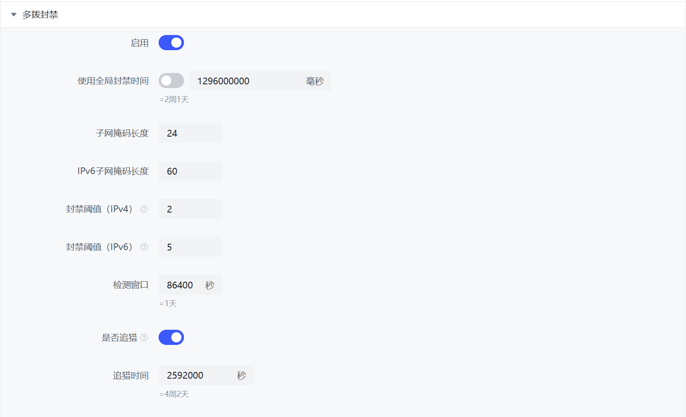

# Multi-Dialing Blocker

Some malicious users acquire a large number of IP addresses from the same subnet by using multi-dialing or similar methods.  
Although ARB (Automatic Range Blocking) has nearly the same functionality as this module, it only activates when a ban condition is met. In contrast, the multi-dialing blocker actively monitors connected peers without waiting for a ban command.

When the number of IP addresses from the same subnet exceeds the specified threshold and these IPs are connected to the same torrent, subnet banning will be initiated.



## Hunting

If an IP is determined to be using multi-dialing, it will continue to search for all other peers within the same subnet, ignoring cache time limits.

Enabling this feature will consume some additional runtime memory.

## Configuration File

```yaml
  # 多拨封禁
  # Multi-dialing blocker
  multi-dialing-blocker:
    enabled: true
    # 封禁时间，单位：毫秒，使用 default 则跟随全局设置
    ban-duration: 1296000000
    # IPV4 前缀长度
    # IPV4 prefix length
    # IP地址前多少位相同的视为同一个子网，位数越少范围越大，一般不需要修改
    # The same prefix ip addresses will trick as in same subnet, usually don't need changes
    subnet-mask-length: 24
    # IPv6 地址前缀长度
    # IPv6 prefix length
    subnet-mask-v6-length: 60
    # 容许同一网段下载同一种子的IP数量，正整数 (IPV4)
    # 防止DHCP重新分配IP、碰巧有同一小区的用户下载同一种子等导致的误判
    # The allowed maximum amount of ips in same subnet
    # To avoid mistake bans that caused by DHCP re-allocated IPs, or multiple users in same city
    tolerate-num-ipv4: 2
    # 容许同一网段下载同一种子的IP数量，正整数 (IPV6)
    # 防止DHCP重新分配IP、碰巧有同一小区的用户下载同一种子等导致的误判
    # The allowed maximum amount of ips in same subnet
    # To avoid mistake bans that caused by DHCP re-allocated IPs, or multiple users in same city
    tolerate-num-ipv6: 5
    # 缓存持续时间（秒）
    # Cache life span
    # 所有连接过的peer会记入缓存，DHCP服务会定期重新分配IP，缓存时间过长会导致误杀
    # All connected peers will record into cache, DHCP may re-allocated IPs.
    cache-lifespan: 86400
    # 是否追猎
    # Keep hunting
    # 如果某IP已判定为多拨，无视缓存时间限制继续搜寻其同伙
    # If a specific IP flagged multi-dialing, should we ignore the caching span and keep searching other IPs in same subnet?
    keep-hunting: false
    # 追猎持续时间（秒）
    # Hunting time
    # keep-hunting为true时有效，和cache-lifespan相似，对被猎杀IP的缓存持续时间
    # Only works when keep-hunting enabled, similar as cache-lifespan
    keep-hunting-time: 2592000
```