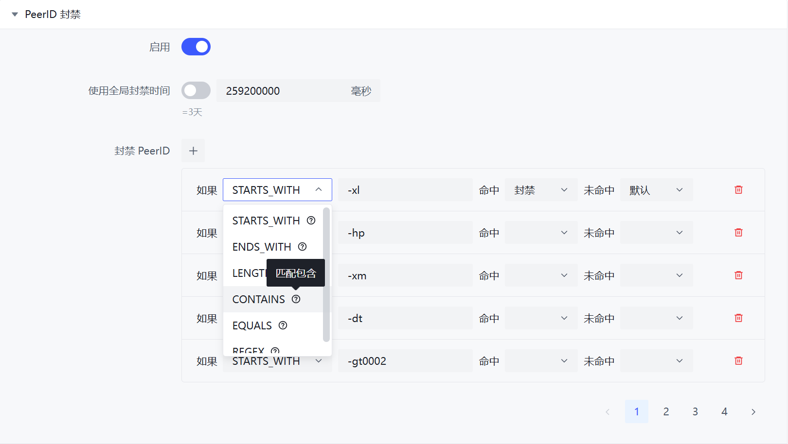

# PeerID Filter

The PeerID filter detects using the PeerID actively reported by the Peer. For clients with a built-in PeerID filter (e.g., qBittorrent Enhanced Edition), it is recommended to use their built-in PeerID filtering feature first.

:::warning
The PeerID is reported by the Peer itself (and can be modified at will), so it cannot be used as the sole basis for determining the client.
:::



## Configuration File

The rules use the [JSON rule engine](../misc/json-engine.md) syntax.

## Configuration File

```yaml
  # PeerId Ban List
  # This module may not work well with Transmission
  peer-id-blacklist:
    enabled: true
    # Ban duration in milliseconds, use default to follow global settings
    ban-duration: 259200000
    # method = Match method
    #  + STARTS_WITH = Match the start of the string
    #  + ENDS_WITH = Match the end of the string
    #  + LENGTH = Match the string length
    #     + additional supported fields
    #       * min = Minimum length
    #       * max = Maximum length
    #  + CONTAINS = Match the content within the string
    #  + EQUALS = Match the exact string
    #  + REGEX = Match the regex (case-sensitive)
    # content = The content to match (case insensitive, except for regex)
    # if = Expression controller, this rule will be checked if the expression evaluates to true; otherwise, it is ignored.
    #  + The expression can be true/false, 1/0, or a nested rule
    # hit = Action code when a match is found
    #  + TRUE = Represents true in the if controller, BAN in the rule
    #  + FALSE = Represents false in the if controller, SKIP in the rule
    #  + DEFAULT = Represents true in the if controller, NO_ACTION in the rule
    # miss = Action code when a match is not found (same as above)
    # Rules are executed from top to bottom
    banned-peer-id:
      - '{"method":"STARTS_WITH","content":"-xl"}'
      - '{"method":"STARTS_WITH","content":"-hp"}'
      - '{"method":"STARTS_WITH","content":"-xm"}'
      - '{"method":"STARTS_WITH","content":"-dt"}'
      - '{"method":"STARTS_WITH","content":"-gt0002"}'
      - '{"method":"STARTS_WITH","content":"-gt0003"}'
      - '{"method":"CONTAINS","content":"-rn0.0.0"}'
      - '{"method":"STARTS_WITH","content":"-sd"}'
      - '{"method":"STARTS_WITH","content":"-xf"}'
      - '{"method":"STARTS_WITH","content":"-qd"}'
      - '{"method":"STARTS_WITH","content":"-bn"}'
      - '{"method":"STARTS_WITH","content":"-dl"}'
      - '{"method":"STARTS_WITH","content":"-ts"}'
      - '{"method":"STARTS_WITH","content":"-fg"}'
      - '{"method":"STARTS_WITH","content":"-tt"}'
      - '{"method":"STARTS_WITH","content":"-nx"}'
      - '{"method":"CONTAINS","content":"cacao"}'
```