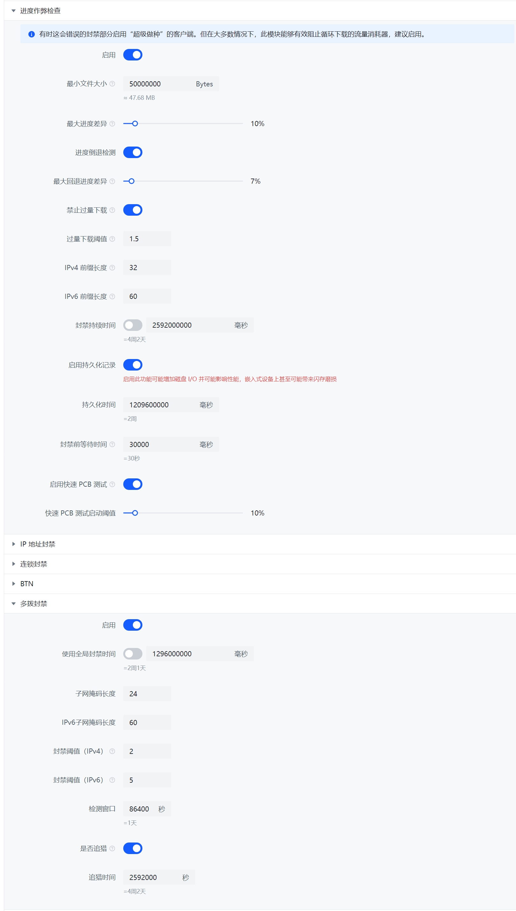

# Progress Checker

The Progress Checker (ProgressCheatBlocker) (sometimes referred to as PCB or heuristic detection algorithm) is a heuristic anti-leech detection algorithm based on download progress created by PeerBanHelper.

## Overview

Traditional anti-leech methods usually rely on checking PeerID or ClientName to block peers. This works well for peers like *Xunlei* or *QQDownload* that report their PeerID truthfully. However, if malicious leechers impersonate normal clients like qBittorrent or Transmission, traditional anti-leech methods will completely fail.

PeerBanHelper continuously tracks the active peers on all active torrents, monitoring their progress in real-time. PeerBanHelper will block peers when the following conditions occur:

* Peer does not report their progress, keeping it at 0%.
* Peer reports a progress value that does not match the actual downloaded progress.
* Peer’s progress resets to zero after reconnecting, or the progress decreases by more than a certain threshold (progress rollback).
* Peer continues downloading after reaching 100% of the torrent size (excessive download).

For the Progress Checker, progress determination is based not on individual IP addresses but on "IP groups." IP addresses in the same group are considered as one peer, regardless of whether the IP, port, PeerID, or ClientName are the same.
* For IPv4, the default group size is `/32`, which represents a single IPv4 address.
* For IPv6, the default group size is `/60`, which is typically the prefix size assigned to routers.

PBH continuously tracks the peer’s download progress and calculates their upload volume and upload increments. When a peer's statistics are reset for some reason (e.g., changing port or PeerID), PBH corrects their progress using previously recorded data to prevent progress cheating.



## Progress Discrepancy

PeerBanHelper calculates the peer's current minimum progress based on downloader data, local record data, and peer-reported data. If the peer's progress is less than the minimum progress (false reporting progress), PeerBanHelper will block the peer.

## Excessive Download

The goal of malicious peers is to download as much data as possible from the victim. Therefore, PeerBanHelper calculates the peer's downloaded volume based on downloader data, local record data, and peer-reported data.

This calculated download volume does not rely entirely on the downloader, as attackers can easily deceive and reset the downloader's statistics.

If the peer's downloaded volume exceeds a certain proportion of the total volume of data owned by the current user (i.e., downloading more data than the total size of the torrents owned), PeerBanHelper will block the peer.

## Persistent Records

When turned off, all data is stored in memory. When memory is insufficient or not used for a period of time, the data will be cleared and deleted. At this point, PeerBanHelper will "forget" the previously recorded data.

When persistent records are enabled, the data will be saved to the database before being deleted from memory and reloaded when needed in the future (as long as the data has not expired). This effectively prevents attackers from using guerrilla tactics and cache forgetting attacks.

## Quick PCB Test

A quick detection algorithm. When the peer's download progress (calculated) reaches the "Quick PCB Test Activation Threshold," PeerBanHelper will temporarily block the peer (default is 30 seconds) to disconnect and then unblock shortly after. Some malicious clients will reset their reported progress to zero after disconnecting, allowing PCB anti-cheat to immediately capture this anomaly and speed up the blocking of abnormal and malicious clients, reducing traffic loss.

## Configuration File

```yaml
  # 进度作弊检查器：Progress Cheat Blocker
  # 注：有时这会错误的封禁部分启用“超级做种”的客户端。但在大多数情况下，此模块能够有效阻止循环下载的流量消耗器，建议启用。
  # Note: Sometimes it may incorrect ban some clients if they enabled "Super Seeding", but in most cases, it can accurately detect the cheat/bad peers.
  progress-cheat-blocker:
    enabled: true
    # Torrent 小于此值不进行检查（单位：字节），对等体可能来不及同步正确的下载进度
    # Skip the check if torrent smaller than this value, unit: bytes, peer may have to no chance to sync the progress
    minimum-size: 50000000
    # 最大差值，单位百分比（1.0 = 100% 0.5=50%）; Max difference, float percentage (1.0=100%, 0.5=50%)
    # PeerBanHelper 根据 BT 客户端记录的向此对等体实际上传的字节数，计算该对等体的最小下载进度
    # PeerBanHelper will use BT client recorded data to check the actual uploaded bytes, and calculate minimal progress that this peer should have
    # 并与对等体汇报给 BT 客户端下载进度进行比较
    # and compare with peer reported progress
    # 如果对等体汇报的总体下载进度远远低于我们上传给此对等体的数据量的比例，我们应考虑客户端正在汇报假进度
    # If peer reported progress is smaller than our calculated progress too much, we will consider it's cheating
    # 默认值为：10%
    # Default allowed percentage is 10%
    # 即：假设我们上传了 50% 的数据量给对方，对方汇报自己的下载进度只有 39%，差值大于 10%，进行封禁
    # It will run like: if we uploaded 50% of data at least to peer, but peer reporting it only have 39%, difference ge 10%, we will ban it
    # 对于自动识别迅雷、QQ旋风的变种非常有效，能够在不更新规则的情况下自动封禁报假进度的吸血客户端
    # It works well on detecting new various and cheat clients.
    maximum-difference: 0.1
    # 进度倒退检测 - Progress rewind detection
    # 默认：最多允许倒退 7% 的进度 - Default: Up to 7% rewind is allowed
    # (考虑到有时文件片段在传输时可能因损坏而未通过校验被丢弃，我们允许客户端出现合理的进度倒退)
    # (Sometimes the pisces may break during transfer, client may drop those pisces, we allow client have rewind in reasonable range)
    # 设置为 -1 以禁用此检测
    # Set to -1 for disabling
    rewind-maximum-difference: 0.07
    # 过量下载：禁止那些在同一个种子的累计下载量超过种子本身大小的客户端
    # Excessive download - Block peers that download even more bytes on a single torrent than the torrent itself
    # 此模块对 Transmission 不起效
    # Not working with Transmission
    block-excessive-clients: true
    # 过量下载计算阈值
    # Calculation threshold
    # 计算方式是： 是否过量下载 = 上传总大小 > (种子总大小 * excessive_threshold)
    # IsExcessive = uploaded > (torrent_size * excessive_threshold)
    excessive-threshold: 1.5
    # IPV4 前缀长度，前缀相同的 IP 都被视为同一个用户
    # IPV4 prefix length, same prefix will trick as a same user
    # 32 = 单个 IP 地址，IPV4 资源宝贵，通常 ISP 不会分配多个 IP 地址
    # 32 = Single IP address, ISP usually only allocate single IPV4 for one user
    ipv4-prefix-length: 32
    # IPV6 前缀长度，前缀相同的 IP 都被视为同一个用户
    # IPV6 prefix length, same prefix will trick as a same user
    # 64 = 常见的 ISP 为单个接入用户分配的前缀长度
    # 64 = The common prefix length that ISP allocate for one user
    ipv6-prefix-length: 60
    ban-duration: 2592000000
    # 启用持久化记录
    # Enable persist recording
    # 启用此功能可能增加磁盘 I/O 并可能影响性能
    # May increase disk I/O and impact the performance
    enable-persist: true
    # 持久化数据存储时长
    # Persist duration
    # 延长此值可缓解针对 PeerBanHelper 的 “缓慢失忆攻击”，但会增加磁盘 I/O 并影响性能
    # Increase this value can alleviate "Slow forgetting attack", This helps stop bad peers from taking advantage of this weakness to reset their data records.
    # 缩短此值可提高性能但吸血者者可能利用这一点进行 “缓慢失忆攻击”
    # Decrease this value may lead to "Slow forgetting attack"
    # 单位：ms 默认值：1209600000 （14 天）
    # Time unit: ms, default: 1209600000 (14 days)
    persist-duration: 1209600000
    # 封禁前最长等待时间
    # Max duration before ban
    # 有时由于下载器网络原因，Peer 可能无法及时同步其进度信息
    # Sometimes due the network issue, the peer may cannot sync the progress information on time
    # 当 Peer 达到封禁阈值后开始计时，如果 Peer 未在给定时间内更新自己的进度到正常水平，则将被封禁
    # When a Peer reached ban condition, the timer will start and Peer will be banned after timer timed out if Peer's progress not update to excepted value on time
    # 注意：这不适用于进度回退和过量下载
    # Note: This not suitable for progress rewind or over-download
    max-wait-duration: 30000
    # 快速 PCB 测试启动阈值
    # Fast PCB testing start threshold
    # 此选项将允许 PCB 在 Peer 下载指定量的数据后，将其短暂的封禁一段时间以便断开其连接
    # This option will allow PCB ban the Peer from downloader for disconnect it
    # 这有助于快速预热进度重置检查
    # Can heat up progress reset check quickly
    # 设置为 -1 以禁用
    # Set to -1 for disable it
    # 百分比为浮点百分比，0.5=50%; 1.0 = 100%
    # Percentage in float, 0.5=50%; 1.0 = 100%
    fast-pcb-test-percentage: 0.1
    # 快速 PCB 测试断开连接持续时间
    # The disconnect duration for fast PCB test
    # 更长的时间更容易使得恶意吸血者的临时记录从 LRU 缓存中逐出，以便 PBH 识别它；但也会影响正常下载者的速度和体验
    # The longer time can lead cheaters temp records be invalid and remove from LRU cache, then PBH can detect it; but it can also affect the normal peers speed and experience
    # 时间单位（Time Unit）: 毫秒（ms）
    fast-pcb-test-block-duration: 15000
```

## Limitations

* If "Allow multiple connections from the same IP address" is not disabled on the downloader, it may cause incorrect statistics and cause rapid growth. This option is disabled by default.