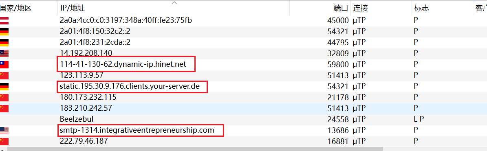
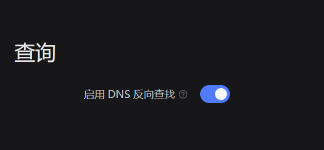
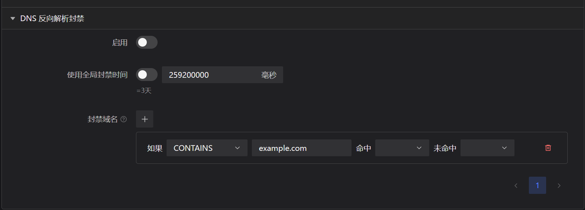

# DNS Reverse Lookup

:::info
This is a [PTR reverse lookup record](https://www.cloudflare.com/learning/dns/dns-records/dns-ptr-record/), not a reverse domain name lookup. This feature resolves **hostnames** rather than domains in a general sense.
:::

## What is a hostname?

If you have used qBittorrent and enabled the "Resolve peer host names" option in the settings, you should be very familiar with the following scenario.

The part marked in red in the image is the "hostname", and this module detects these "hostnames".

## Usage

### Allow DNS Reverse Lookup

By default, PeerBanHelper's DNS reverse lookup feature is disabled. This is because frequent queries may cause the DNS server you are using to refuse to continue providing services, thereby affecting your normal internet usage.

You need to go to "Settings -> Basic Settings -> Query" and enable the "Enable DNS Reverse Lookup" option, then save.

### Enable DNSJava

By default, PeerBanHelper uses the JDK resolver, but the JDK resolver usually does not work well. Therefore, it is best to enable the "DNSJava Experiment".

Go to "Settings -> Labs", then enable "Enable Experimental Features". Find and enable "DNSJava DNS Resolver" in the list below, and you will switch to the DNSJava resolver.

### Configure Rules

Go to "Settings -> Preferences -> DNS Reverse Lookup Records", expand it to configure the corresponding rules for hostnames.

