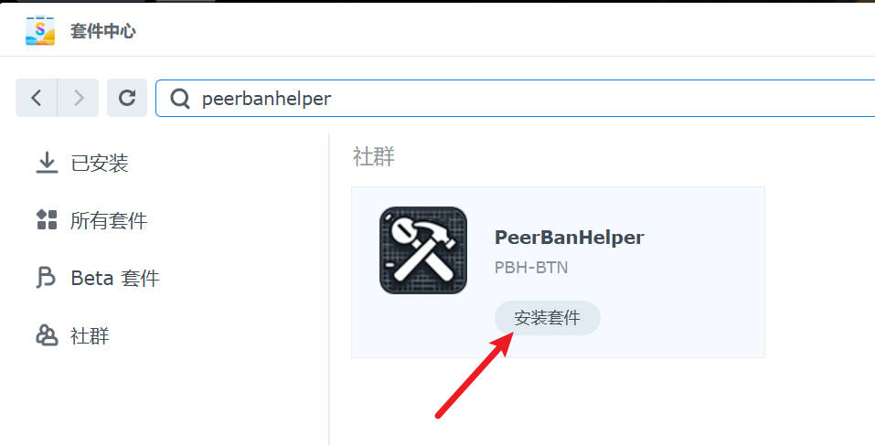
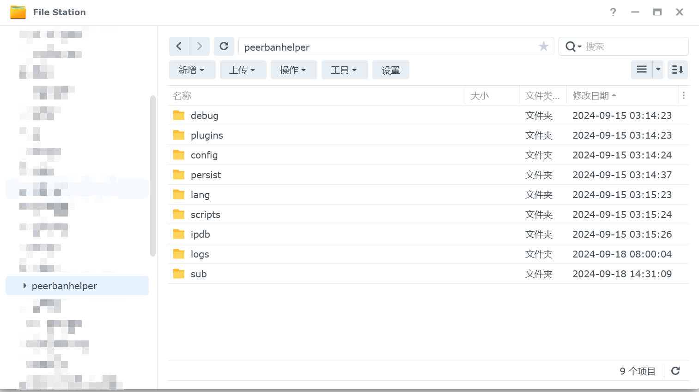
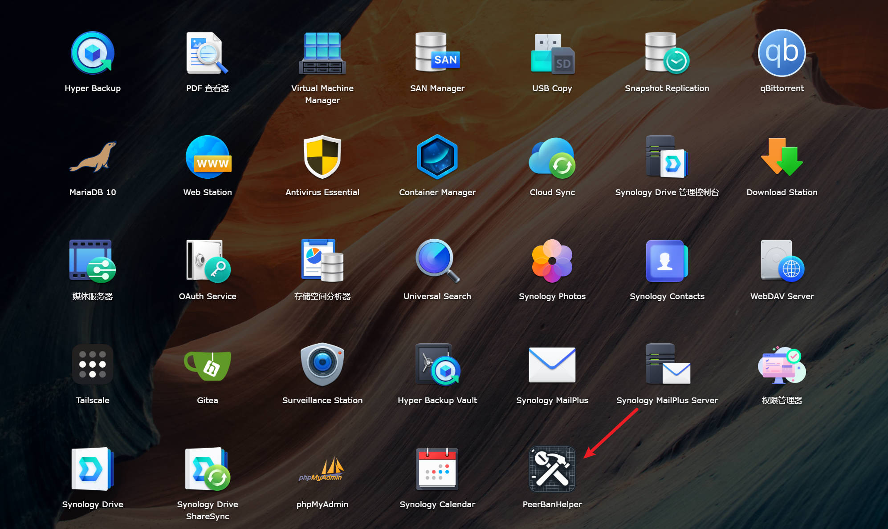
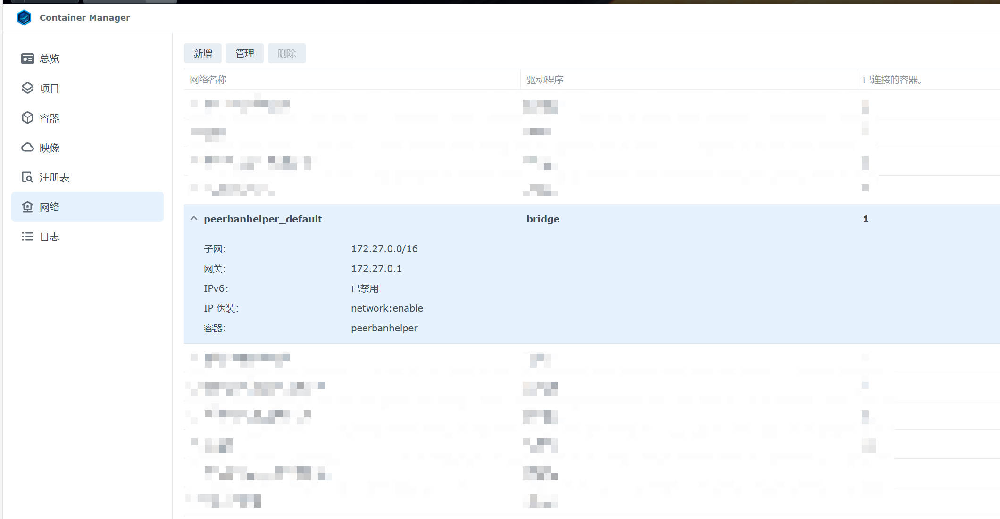

# Package Method

## Add Miner SPK7 Source

PeerBanHelper has partnered with [imnks.com](https://imnks.com/) to bring PeerBanHelper to Synology's Package Center as a container package, offering installation and update services.

First, please follow the [official Miner SPK source tutorial](https://imnks.com/1780.html) to enable the Miner community source on your DSM device.

## Install PBH in Package Center

After adding the Miner community source, you can go to the Community tab and search for "PeerBanHelper" in the search box.

Once you find PeerBanHelper, click "Install Package" to install it.

Follow the installation wizard to complete the subsequent configuration process.

## Modify PeerBanHelper Configuration

After installation, PeerBanHelper will automatically create a shared folder named `peerbanhelper`, where you can manage all PBH-related files. You can also switch storage locations, but performing any operations other than switching the storage location on the shared folder itself may cause malfunctions.

To access the WebUI, you can find the PBH program icon in the main menu and click it to open the WebUI.

To manage the container, you can find the PBH project in the Container Manager.

## Configure Downloader

Although you are installing the package, it is essentially (for now) still a Docker container. Therefore, you need to configure the network according to Docker steps. When accessing the downloader on the same NAS, use the gateway address instead of `127.0.0.1` or `localhost`. The gateway address can be found in Container Manager -> Network -> peerbanhelper_default.

