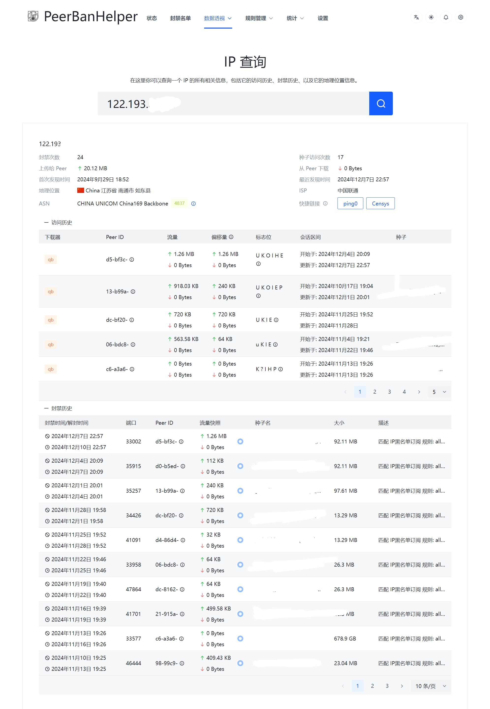

# IP Query

IP Query allows you to query the record information of a given IP address in PeerBanHelper's GeoIP data. If PBH Plus is unlocked, it will also display the ban history and access history data of this IP.

## Access History

After enabling [Active Monitoring](../module/active-monitoring.md), access history data will be recorded. You can view the statistics of this Peer visiting different torrents on your downloader.

## Ban History

Records all associated ban operations under this IP address.

## Quick Links

Provides two very useful external IP analysis tools that can analyze the anomalies of the IP and the services running on it.

These two external tools are not related to PeerBanHelper or PBH-BTN, and we are not responsible for the information on them.