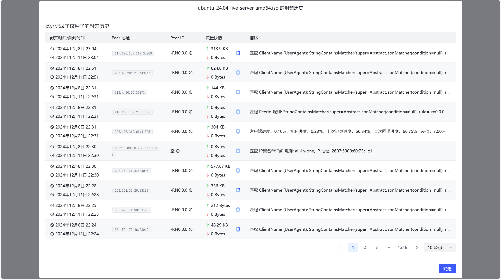

# Torrent Query

PeerBanHelper records the basic metadata (such as name, infohash, and size) of torrents that have been active on the downloader during its operation. This data is cached in the database for use by other modules, avoiding duplicate records and reducing hard disk space waste.

The torrent query module uses this recorded data to show you the connection and ban status of torrents associated with PeerBanHelper.

Click the button of the record you want to query to open the record query page, which records all access or ban records associated with this torrent.

:::tip

Although not intended, if your downloader crashes and all saved torrents are lost, you can use the hash values recorded here to reassemble them into magnet links and re-download the metadata.

:::